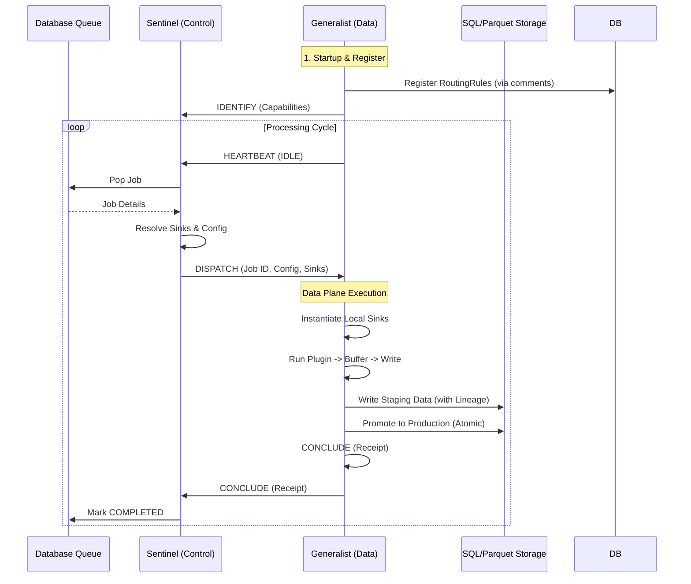

# Casparian Flow Architecture Guide (v4.0 - Split Plane)

A comprehensive mental model for the Casparian Flow system.

---

## High-Level Overview

Casparian Flow is an autonomous **file-to-data pipeline**. It turns "dark data" (files on disk) into structured, queryable datasets (SQL/Parquet) through a distributed, pull-based architecture.

**Core Principles:**
1.  **Split Plane Architecture:** Control messages flow through the Sentinel; Data flows directly from Workers to Storage/DB.
2.  **Pull-Based Processing:** Workers explicitly request jobs when ready (Load Balancing).
3.  **Immutable Versioning:** Every file change creates a new version; jobs process specific versions.
4.  **Code-First Configuration:** Plugin source code is the source of truth for routing and schemas.

---

## Directory Structure


```

src/casparian_flow/
├── config.py          # Global Pydantic settings
├── context.py         # Environmental Context (Host, User, GitHash)
├── sdk.py             # User-facing BasePlugin API
├── interface.py       # Internal Plugin Protocol
├── main.py            # Sentinel Entry Point
├── protocol.py        # Binary Protocol v4 (Split Plane)
├── mcp_server.py      # MCP Server for LLM Integration
├── db/
│   ├── models.py      # SQLAlchemy Models (The Source of Truth)
│   ├── access.py      # DB Engine & Bulk Loaders
│   └── setup.py       # Schema Fingerprinting & Init
├── engine/
│   ├── sentinel.py    # The Broker (Control Plane)
│   ├── worker_client.py # The Generalist Worker (Data Plane)
│   ├── queue.py       # Atomic Job Queue
│   ├── sinks.py       # Output Adapters (Parquet/SQLite/MSSQL) -> Used by Worker
│   └── config.py      # Engine Config Models
├── services/
│   ├── scout.py       # Discovery Service (Inventory + Tagger)
│   ├── fs_engine.py   # Parallel Directory Walker
│   ├── registrar.py   # Code-First Plugin Registration
│   ├── architect.py   # Plugin Deployment & Governance
│   ├── inspector.py   # File Profiling
│   ├── llm_generator.py # AI Code Generation
│   └── test_generator.py # AI Test Generation
├── agents/
│   └── surveyor.py    # Autonomous Onboarding Agent
└── security/
└── gatekeeper.py  # Static Analysis & Signatures

```

---

## Process Architecture: The Split Plane Model

Casparian Flow uses a **Split Plane** architecture. The **Control Plane** (Sentinel <-> Worker) uses ZeroMQ for coordination, while the **Data Plane** (Worker -> Sink) writes directly to storage.



### Components

1. **Sentinel (The Controller)**
* **Role:** The "Brain". Manages the Job Queue and Worker orchestration.
* **Responsibility:**
* Tracks connected workers and their capabilities.
* Matches pending jobs to idle workers.
* **Configuration:** Eagerly loads `TopicConfig` to send Sink instructions to workers.
* **No Data:** Does *not* touch the data payload.

2. **Generalist Worker (The Executor)**
* **Role:** The "Muscle". Compute + I/O node.
* **Responsibility:**
* Scans its local `plugins/` directory.
* **Execution:** Runs user code.
* **Sinks:** Instantiates local Sinks (SQL, Parquet) based on instructions from Sentinel.
* **Buffering:** Buffers rows in memory to minimize I/O transactions.
* **Lineage:** Injects `_job_id` and `_file_version_id` into every row.
* **Reporting:** Sends a `JobReceipt` (metrics, artifacts) back to Sentinel.


3. **Protocol v4 (!BBHQI)**
* **Format:** Fixed 16-byte binary header (`!BBHQI`) + Payload.
* **Fields:** Version, OpCode, Reserved, JobID (8 bytes), Length (4 bytes).
* **OpCodes:**
* `IDENTIFY (1)`: Handshake with capabilities.
* `DISPATCH (2)`: Command to process a file (includes Sink Configs).
* `ABORT (3)`: Cancel job.
* `HEARTBEAT (4)`: Keep-alive / Status.
* `CONCLUDE (5)`: Job finished + Receipt.
* `ERR (6)`: Error reporting.


---

## Discovery Architecture: The Split Scout

Discovery is decoupled into **I/O** and **Logic** phases to handle millions of files efficiently.

### 1. Inventory Scanner (Fast I/O)

* **Goal:** Mirror the filesystem state to the Database.
* **Action:** Walks directories using `ParallelFileScanner`.
* **Updates:** `FileLocation` table (path, filename, `last_known_mtime`, `last_known_size`).
* **Constraint:** Never reads file content. Never hashes. Extremely fast.

### 2. Tagger Service (Logic & CPU)

* **Goal:** Determine what needs processing.
* **Action:** Polls DB for "Dirty" files.
* *Dirty Criteria:* `FileLocation.last_known_mtime` != `FileVersion.modified_time`.


* **Processing:**
1. Calculates SHA-256 Hash.
2. Creates immutable `FileVersion`.
3. Matches path against `RoutingRule`s.
4. Applies Tags.
5. Queues `ProcessingJob` if tags match a `PluginConfig`.


---

## Detailed Workflows

### Workflow A: The Discovery Loop (Scout)

1. **Scan:** `InventoryScanner` walks `SourceRoot`. Upserts `FileLocation` records.
2. **Detect:** `TaggerService` queries for files where the inventory `mtime` differs from the current version.
3. **Hash:** Tagger computes content hash (SHA-256). checks `FileHashRegistry` for deduplication.
4. **Version:** Creates a new `FileVersion` linked to the location.
5. **Route:** Checks `RoutingRule` table (e.g., `*.csv` -> `csv_tag`). Saves tags to `FileVersion`.
6. **Queue:** Checks `PluginConfig` subscriptions. If tags match, inserts `ProcessingJob` with QoS priority.

### Workflow B: The Processing Loop (Split Plane)

1. **Connect:** Generalist Worker connects to Sentinel. Sends `IDENTIFY`.
2. **Idle:** Worker sends `HEARTBEAT` (Idle).
3. **Dispatch:** Sentinel finds match in `JobQueue`.
* Resolves `TopicConfig` for the plugin (e.g., Output -> SQL Table).
* Sends `DISPATCH` message with Sinks and File Path.
4. **Execute:** Worker receives `DISPATCH`.
* Initializes local Sinks (e.g., `MssqlSink`).
* Runs Plugin.
* Intercepts `publish()` calls.
* **Lineage:** Injects `_job_id` and `_file_version_id`.
* Buffers and writes to Staging Tables/Files.
5. **Commit:** Worker finishes execution.
* Promotes Staging to Production (Atomic).
* Sends `CONCLUDE` with Receipt (Rows processed, Artifacts generated).
6. **Complete:** Sentinel marks Job `COMPLETED` in DB.


### Workflow C: The Surveyor Agent (Autonomous Onboarding)

A generic agent that sets up the pipeline for you.

1. **Reconnaissance:** Queries DB for unindexed files. Picks a sample.
2. **Environment:** Checks `LibraryWhitelist` for available tools.
3. **Construction:**
* **Inspect:** Profiles file header/structure.
* **Draft:** LLM proposes schema/plugin logic.
* **Build:** LLM generates Python plugin code.
* **Deploy:** Submits code to Architect.


4. **Wiring:** Auto-creates `RoutingRule` (e.g., `*.xml` -> `xml_parser`) and `TopicConfig`.
5. **Verification:** Waits for a `ProcessingJob` to succeed.
6. **Test Gen:** Generates a `pytest` file for the new plugin.

---

## Data Models

| Model | Purpose |
| --- | --- |
| `SourceRoot` | Root directory being watched. |
| `FileLocation` | Mutable record of a file path on disk + Inventory state. |
| `FileVersion` | Immutable snapshot of content (SHA-256) + Tags. |
| `ProcessingJob` | Unit of work linking a Version to a Plugin. |
| `RoutingRule` | Glob Pattern (`*.csv`) -> Tag (`finance_data`). |
| `PluginConfig` | Plugin settings + Subscription (`finance_data`). |
| `TopicConfig` | Logical Topic (`sales`) -> Physical URI (`sqlite:///sales.db`). |
| `PluginManifest` | Registry of source code for managed/AI plugins. |
| `SurveyorSession` | State tracking for autonomous agent runs. |

---

## Configuration (Code-First)

Plugins configure the system via "Magic Comments" in their source code. The Worker reads these on startup and updates the Database.

```python
# plugins/my_parser.py

# PATTERN: *.csv           <-- Auto-creates RoutingRule
# TOPIC: sales_data        <-- Auto-creates TopicConfig (Default Parquet)

from casparian_flow.sdk import BasePlugin

class Handler(BasePlugin):
    def execute(self, path):
        # ...
        self.publish("sales_data", df)

```

---

## Integrity & Security

1. **Lineage:** Every row in the output DB includes `_job_id` and `_file_version_id`, traceable back to the exact source file hash.
2. **Gatekeeper:** AI-generated code passes through AST validation (banned imports like `os`, `subprocess`) and HMAC signature verification before running.
3. **Concurrency:** Output files use unique job-IDs to prevent race conditions.
4. **Atomic Promotion:** Data is written to `_stg` tables. It is only moved to production tables if the job completes successfully.
