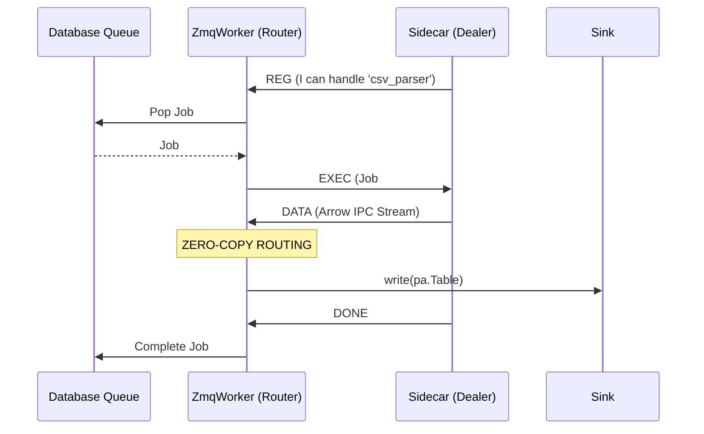
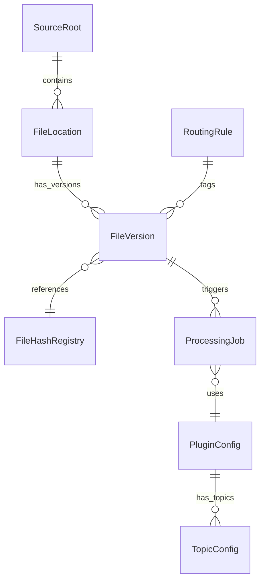
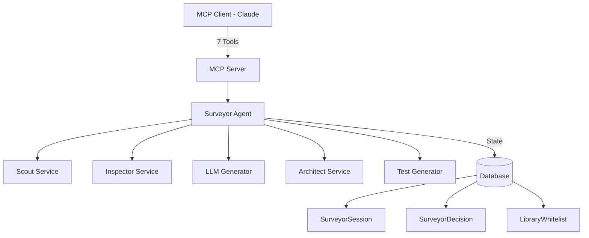
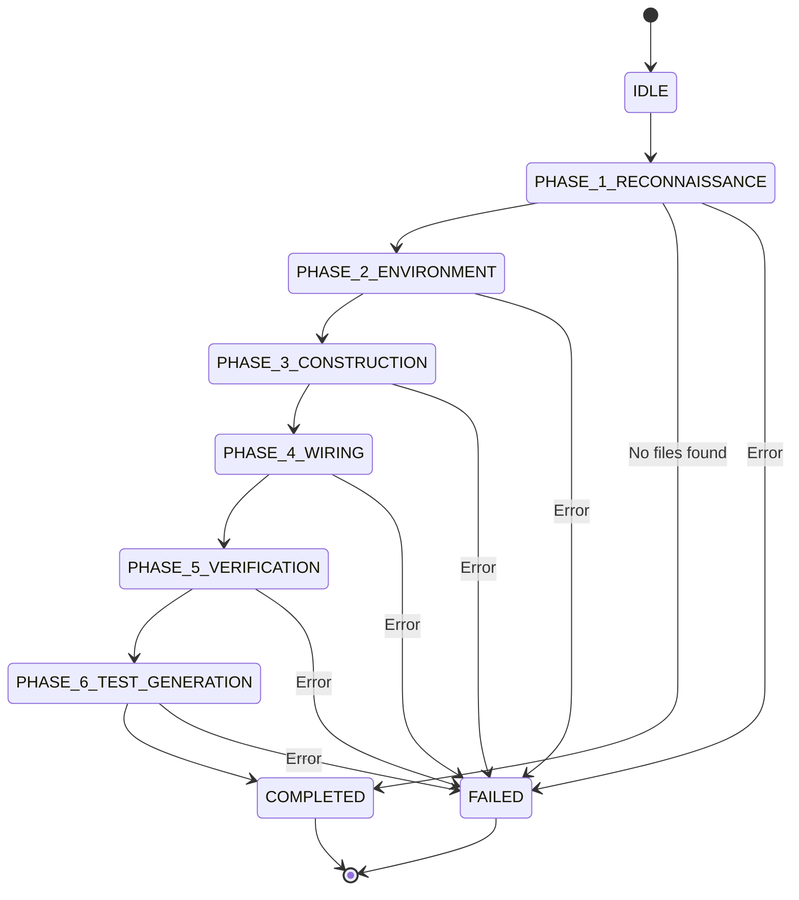

Here is the complete, updated `ARCHITECTURE.md` incorporating the ZeroMQ process isolation architecture.

````markdown
# Casparian Flow Architecture Guide

A mental model for understanding the entire codebase.

---

## High-Level Overview

Casparian Flow is a **file-to-database pipeline** that watches directories, detects file changes, and transforms them into structured data.

```mermaid
graph LR
    A[File System] -->|Scout| B[Job Queue]
    B -->|ZmqWorker| C[Sidecar Process]
    C -->|Plugin| D[Output DB/Parquet]
````

**Core principle**: Files flow through the system immutably. Every file version is tracked, every job is auditable.

-----

## Directory Structure

```
src/casparian_flow/
├── config.py          # Pydantic settings from TOML
├── context.py         # EtlContext (git hash, env info)
├── sdk.py             # BasePlugin class for user plugins
├── interface.py       # CaspPlugin protocol definition
├── main.py            # Entry point
├── protocol.py        # Binary wire protocol definitions (OpCodes, Headers) [NEW v2]
├── sidecar.py         # Isolated plugin execution process [NEW v2]
├── mcp_server.py      # MCP server with 10 tools + 4 resources [NEW v2.1]
├── db/
│   ├── models.py      # SQLAlchemy data models (THE HEART)
│   ├── base_session.py# SessionLocal factory
│   ├── access.py      # Engine creation, bulk upload
│   └── setup.py       # DB initialization, schema fingerprinting, seeding
├── engine/
│   ├── worker.py      # Legacy In-Process Job processor
│   ├── zmq_worker.py  # ZMQ-based Router Worker [NEW v2]
│   ├── queue.py       # JobQueue (pop/complete/fail)
│   ├── context.py     # WorkerContext (lineage injection)
│   ├── sinks.py       # Parquet/SQLite/MSSQL outputs
│   ├── heartbeat.py   # Worker node heartbeat
│   ├── config.py      # WorkerConfig dataclass
│   └── loader.py      # PluginRegistry discovery
├── services/
│   ├── scout.py       # File scanner (CORE LOGIC)
│   ├── fs_engine.py   # Parallel file walker
│   ├── architect.py   # Plugin deployment governance [NEW v2]
│   ├── inspector.py   # File profiling & type detection [NEW v2]
│   ├── llm_provider.py# LLM abstraction layer [NEW v2]
│   ├── llm_generator.py # AI-based code generation [NEW v2]
│   ├── ai_hook.py     # AI workflow orchestration [NEW v2]
│   ├── ai_types.py    # POD structures for AI operations [NEW v2]
│   └── test_generator.py # Pytest test generation [NEW v2.1]
├── agents/            # Autonomous agent framework [NEW v2.1]
│   ├── __init__.py
│   └── surveyor.py    # 6-phase Surveyor Agent
├── security/          # Security validation [NEW v2]
│   └── gatekeeper.py  # AST validation, signatures
└── builtins/          # Compiled-in System Plugins [NEW v2]
    └── system_deployer.py

plugins/               # User-generated Runtime Plugins
    └── generated_plugin.py

tests/
├── conftest.py        # Shared fixtures
├── test_surveyor_agent.py  # Surveyor Agent tests [NEW v2.1]
└── generated/         # Auto-generated tests [NEW v2.1]
    └── __init__.py
```

-----

## Process Architecture (ZMQ Isolation & Data-Oriented Design)

To ensure system stability and high throughput, Casparian Flow uses a **Split Architecture** that decouples the engine from user code, optimized with **Data-Oriented Design** principles.

### The Topology



### Components

1.  **ZmqWorker (The Router)**

      * Binds to a TCP or IPC socket.
      * **Routing Table**: Caches plugin configurations (`TopicConfig`) in memory to avoid DB lookups in the hot path.
      * **Zero-Copy Routing**: Forwards Arrow IPC buffers from Sidecars directly to Sinks without unpacking/deserializing them into Pandas.
      * **Mechanism over Policy**: separating the plumbing (moving bytes) from policy (DB config).

2.  **Sidecar (The Dealer)**

      * A separate OS process (Python interpreter).
      * Loads **one** specific plugin and runs it in a loop.
      * **Isolation**: If this process dies, the Worker detects the disconnect and marks the job as FAILED.

3.  **The Protocol (v2)**

      * Defined in `src/casparian_flow/protocol.py`.
      * **Header**: Fixed 16-byte binary header `!BBHIQ` (Version, OpCode, Flags, MetaLength, JobID).
      * **Zero-Copy Payload**: Uses Apache Arrow IPC streams.
      * **OpCodes**:
          * `REG (1)`: Registration handshake.
          * `EXEC (2)`: Command to process a file.
          * `DATA (3)`: Stream of Arrow batches.
          * `ERR (4)`: Exception info.
          * `DONE (5)`: Job success signal.
          * `HEARTBEAT (6)`: Keep-alive ping.
          * `DEPLOY (7)`: Hot deployment payload.

-----

## The Data Models (The Heart)

All models live in `src/casparian_flow/db/models.py`. Understanding these is critical.

### Entity Relationship



### Key Models

| Model | Purpose | Primary Key |
|-------|---------|-------------|
| `SourceRoot` | A watched directory (e.g., `/data/invoices`) | `id` |
| `FileLocation` | A persistent path within a SourceRoot | `id` |
| `FileVersion` | Immutable snapshot of file content | `id` |
| `FileHashRegistry` | Deduplication registry (content-addressed) | `content_hash` |
| `ProcessingJob` | A unit of work in the queue | `id` |
| `PluginConfig` | Plugin settings + subscribed tags | `plugin_name` |
| `TopicConfig` | Output sink configuration per topic | `id` |
| `RoutingRule` | Pattern → Tag mapping (glob-based) | `id` |
| `WorkerNode` | Active worker heartbeat registry | `hostname + pid` |
| `PluginManifest` | AI-generated plugin code registry | `id` |
| `SurveyorSession` | Surveyor Agent execution state | `id` |
| `SurveyorDecision` | Surveyor Agent decision audit trail | `id` |
| `LibraryWhitelist` | Approved Python packages for plugins | `id` |

### The Versioning Pattern

```
FileLocation (persistent path)
    └── FileVersion (immutable snapshot)
            └── content_hash → FileHashRegistry

When file changes:
1. Scout detects new hash
2. Creates NEW FileVersion (old one preserved)
3. Updates FileLocation.current_version_id
```

**Why?** Audit trail. Every job permanently references the exact file content it processed.

-----

## Services Layer

The `src/casparian_flow/services/` directory contains the core logic that operates outside the ZMQ Worker's hot loop.

### 1. The Scout (`scout.py`)
Responsible for **File Discovery and Ingestion**.
- Uses `fs_engine.py` for parallel directory walking.
- Detects file changes (SHA-256).
- Manages `FileHashRegistry` and `FileVersion` immutability.
- **Output**: Pushes `ProcessingJob`s to the Database Queue.

### 2. The Architect (`architect.py`) [NEW in v2]
Responsible for **Plugin Governance and Deployment**.
- Handles `DEPLOY` OpCodes.
- Verifies HMAC signatures of new plugin code.
- Persists valid code to `PluginManifest` table.
- Orchestrates the "Hot Reload" of sidecars.

### 3. The Surveyor Agent (`agents/surveyor.py`) [NEW in v2.1]
Responsible for **Autonomous Data Pipeline Orchestration**.
- Executes the 6-phase Surveyor Protocol to automatically discover, analyze, and process unindexed files.
- Integrates with Inspector, LLMGenerator, Architect, and TestGenerator services.
- Maintains resumable state in `SurveyorSession` and `SurveyorDecision` tables.
- Exposes 7 MCP tools for LLM-driven orchestration.

-----

## The Surveyor Agent: Autonomous Pipeline Generation

The Surveyor Agent is an autonomous orchestration layer that transforms "dark data" (unprocessed files) into structured, queryable data pipelines.

### Architecture



### The 6-Phase Protocol

The Surveyor executes a deterministic state machine stored in the database:



#### Phase Details

| Phase | Action | Inputs | Outputs |
|-------|--------|--------|---------|
| **Phase 1: Reconnaissance** | Query unprocessed FileVersions, select representative sample | Database | Sample file_version_id |
| **Phase 2: Environment Check** | Query LibraryWhitelist for available packages | Database | List of allowed libraries |
| **Phase 3: Construction** | Profile file → LLM schema proposal → Generate plugin → Deploy | Sample file, Libraries | Deployed plugin manifest_id |
| **Phase 4: Wiring** | Create RoutingRule + PluginConfig subscriptions | Plugin name, File pattern | Routing configured |
| **Phase 5: Verification** | Check ProcessingJob statistics for deployed plugin | Plugin name | Job counts |
| **Phase 6: Test Generation** | Generate pytest test file using LLM | Plugin code, Schema | Test file path |

### MCP Tools Integration

The Surveyor exposes 7 tools via the Model Context Protocol (MCP):

```python
# 1. Register and scan a directory
register_and_scan_path("/path/to/data")
# Returns: "Scan complete for '/path/to/data'. Files: 150, Versions: 200"

# 2. Find unprocessed files
sample_unprocessed_files(limit=5)
# Returns: JSON list of [{file_version_id, path, size, tags}, ...]

# 3. Inspect file header (magic bytes)
inspect_file_header(file_id=123, bytes_to_read=512)
# Returns: {file_type: "TEXT_CSV", hex_header: "636f6c31...", ...}

# 4. List whitelisted libraries
list_allowed_libraries()
# Returns: [{library: "pandas", version: ">=2.0.0", ...}, ...]

# 5. Deploy plugin with validation
deploy_plugin(name="csv_parser", code="...")
# Returns: {success: true, manifest_id: 42, error: null}

# 6. Configure routing rules
configure_routing(pattern="*.csv", tag="csv_data", plugin_name="csv_parser")
# Returns: "Routing configured: *.csv -> csv_data -> csv_parser"

# 7. Check system status
get_system_status()
# Returns: {queued_jobs: 10, running_jobs: 2, failed_jobs_count: 0, ...}
```

### Database Models

#### SurveyorSession
Tracks the execution state of a Surveyor protocol run.

```python
class SurveyorSession(Base):
    id: int
    source_root_id: int
    current_phase: PhaseEnum  # IDLE → PHASE_1 → ... → COMPLETED
    started_at: DateTime
    completed_at: DateTime
    error_message: Text
    phase_data: Text  # JSON blob for phase-specific state
```

#### SurveyorDecision
Audit trail of every decision made by the agent.

```python
class SurveyorDecision(Base):
    id: int
    session_id: int
    phase: PhaseEnum
    timestamp: DateTime
    decision_type: str  # "sample_selected", "plugin_deployed", etc.
    decision_data: Text  # JSON
    reasoning: Text
```

#### LibraryWhitelist
Approved Python packages for plugin generation.

```python
class LibraryWhitelist(Base):
    id: int
    library_name: str  # "pandas", "numpy", etc.
    version_constraint: str  # ">=2.0.0"
    description: Text
    added_at: DateTime
```

Seeded with common libraries:
- pandas (>=2.0.0) - DataFrame processing
- pyarrow (>=22.0.0) - Parquet and Arrow
- numpy (>=1.26.0) - Numerical computing
- sqlalchemy (>=2.0.0) - Database operations
- pydantic (>=2.0.0) - Data validation
- openpyxl (>=3.0.0) - Excel files
- pypdf (>=5.0.0) - PDF processing

### Test Generation (Phase 6)

The Surveyor generates pytest tests for deployed plugins using LLM-based code generation:

```python
class TestGenerator:
    def generate_test(
        plugin_manifest: PluginManifest,
        schema_proposal: SchemaProposal,
        sample_file: FileLocation,
    ) -> GeneratedTest:
        """
        Generates pytest test that:
        1. Uses existing conftest.py fixtures
        2. Creates sample input data
        3. Executes plugin via WorkerContext
        4. Verifies output matches schema
        5. Checks error handling
        """
```

Generated tests are written to `tests/generated/test_{plugin_name}.py` and follow project patterns.

### Usage Patterns

#### Programmatic (Python)
```python
from casparian_flow.mcp_server import get_surveyor_agent, get_db

with get_db() as db:
    agent = get_surveyor_agent(db)
    session = agent.create_session(source_root_id=1)

    # Execute full protocol
    while session.current_phase != PhaseEnum.COMPLETED:
        result = agent.execute_phase(session)
        if not result.success:
            print(f"Failed: {result.error}")
            break
```

#### Via MCP (Recommended)
Claude or other MCP clients can orchestrate the Surveyor by calling the 7 MCP tools in sequence, inspecting results at each step, and making decisions based on file types, system status, etc.

### Resumability

If a Surveyor session fails (e.g., LLM timeout, network error), it can be resumed:

```python
session = db.query(SurveyorSession).filter_by(
    current_phase=PhaseEnum.PHASE_3_CONSTRUCTION
).first()

# Resume from Phase 3
result = agent.execute_phase(session)
```

All phase data and decisions are preserved in the database.

-----

## Contexts: The Two Truths

The system maintains two distinct types of context, often confused but serving different scopes.

| Context | Class | File | Scope | Purpose |
| :--- | :--- | :--- | :--- | :--- |
| **Environmental** | `EtlContext` | `src/casparian_flow/context.py` | Process | Captures Git Hash, Hostname, User. Used by `Heartbeat` to identify the worker node's version/location. |
| **Execution** | `WorkerContext` | `src/casparian_flow/engine/context.py` | Job | Captures JobID, FileVersionID. Injects lineage into data streams. Manages Sinks. |

-----

## The Queue (Job Management)

`src/casparian_flow/engine/queue.py` provides atomic job claims.

### SQLite Mode (Dev)

Simple query + update (no locking).


### MSSQL Mode (Production)

Atomic CTE with row locks:

```sql
WITH cte AS (
    SELECT TOP(1) * FROM queue 
    WITH (ROWLOCK, READPAST, UPDLOCK)
    WHERE status = 'QUEUED'
    ORDER BY priority DESC, id ASC
)
UPDATE cte SET status = 'RUNNING' ...
OUTPUT inserted.*;
```

-----

## The Sinks (Output Writers)

`src/casparian_flow/engine/sinks.py` handles writing processed data.

### Supported Sinks

| URI Scheme | Destination | Example |
|------------|-------------|---------|
| `parquet://` | Parquet files | `parquet://./output` |
| `sqlite://` | SQLite table | `sqlite://data.db/table` |
| `mssql://` | SQL Server | `mssql://schema.table` |

### Staging Pattern (Blue/Green)

All sinks use staging for atomicity:

```
1. write() → staging table/file
2. promote() → move to production
3. On error: staging is discarded
```

-----

## The Plugin System

### BasePlugin (`src/casparian_flow/sdk.py`)

```python
class BasePlugin:
    def configure(self, ctx, config):
        """System injects dependencies."""
        self._ctx = ctx
        
    def publish(self, topic: str, data: DataFrame):
        """User calls this to output data."""
        self._ctx.register_topic(topic)
        self._ctx.publish(handle, data)  # Lineage injected here
```

### Plugin Discovery (`src/casparian_flow/engine/loader.py`)

1.  Scans `plugins/` directory for `.py` files
2.  Dynamically imports each module
3.  Looks for `Handler` class
4.  Caches in registry

### User Plugin Example

```python
from casparian_flow.sdk import BasePlugin
import pandas as pd

class Handler(BasePlugin):
    def execute(self, file_path: str):
        df = pd.read_csv(file_path)
        self.publish('output', df)
```

-----

## Configuration System

### Global Config (`src/casparian_flow/config.py`)

Uses Pydantic Settings with TOML:

```toml
# global_config.toml
[database]
type = "sqlite3"
db_location = "casparian_flow.sqlite3"
```

### Worker Config (`src/casparian_flow/engine/config.py`)

```python
@dataclass
class WorkerConfig:
    database: DatabaseConfig
    storage: StorageConfig  
    plugins: PluginsConfig
```

-----

## Integrity & Security

### Schema Fingerprinting (`src/casparian_flow/db/setup.py`)

The system uses **database-based schema fingerprinting** (not file hashing):

1.  Query live database structure via SQLAlchemy inspector
2.  Build canonical representation: `table:column:TYPE`
3.  SHA-256 hash of the canonical string

<!-- end list -->

```python
def compute_schema_fingerprint(engine) -> str:
    """Returns stable hash of database structure."""
    # Immune to whitespace/comment changes in code
```

### Database Integrity

Inspector validates all expected tables and columns exist.

-----

## Data Flow Summary

```
┌─────────────────────────────────────────────────────────────────────┐
│                           SCOUT PHASE                               │
├─────────────────────────────────────────────────────────────────────┤
│  1. ParallelFileScanner walks SourceRoot directories               │
│  2. For each file: compute SHA-256 hash                            │
│  3. Check FileHashRegistry for deduplication                       │
│  4. Upsert FileLocation (path) and FileVersion (content)           │
│  5. Apply RoutingRules → assign tags                               │
│  6. Match tags to PluginConfig subscriptions                       │
│  7. Create ProcessingJob with QoS priority                         │
└─────────────────────────────────────────────────────────────────────┘
                              │
                              ▼
┌─────────────────────────────────────────────────────────────────────┐
│                          WORKER PHASE                               │
├─────────────────────────────────────────────────────────────────────┤
│  1. JobQueue.pop_job() atomically claims a QUEUED job              │
│  2. Resolve file path: FileVersion → FileLocation → SourceRoot     │
│  3. ZmqWorker dispatches job via ZMQ (EXEC) to Sidecar             │
│  4. Sidecar processes file, streams DATA (Arrow) back to Worker    │
│  5. Worker writes to Sink (Staging) with injected lineage          │
│  6. On DONE signal: Sink.promote() moves staging → production      │
│  7. JobQueue.complete_job() marks job COMPLETED                    │
└─────────────────────────────────────────────────────────────────────┘
```

-----

## Testing Strategy

| Test File | Focus |
|-----------|-------|
| `test_smoke.py` | End-to-end: Scout → Queue → Worker → Sink |
| `test_queue.py` | Priority ordering, atomic claims, completion |
| `test_zmq_integration.py` | Protocol encoding, message flow |
| `test_zmq_e2e.py` | Full multi-process system test (5 tests) ✅ |
| `test_worker.py` | Error handling, job failure marking |
| `test_surveyor_agent.py` | Surveyor Agent 6-phase protocol (6 tests) ✅ |
| `test_ai_hooks.py` | AI workflow integration |
| `test_architect.py` | Plugin deployment and validation |

Key fixtures in `conftest.py`:

  - `temp_test_dir`: Isolated test data directory
  - `test_db_engine`: Fresh SQLite per test
  - `test_db_session`: Test database session
  - `test_source_root`: Pre-configured SourceRoot ID
  - `architect_service`: ArchitectService with test key
  - `sample_plugin_code`: Valid plugin source for testing

### Test Coverage

**Unit Tests**: Agent phases, services, utilities
**Integration Tests**: ZMQ protocol, database operations
**E2E Tests**: Full workflow from file discovery to data output
**Generated Tests**: Auto-created by Surveyor Agent (Phase 6)

<!-- end list -->

```
```