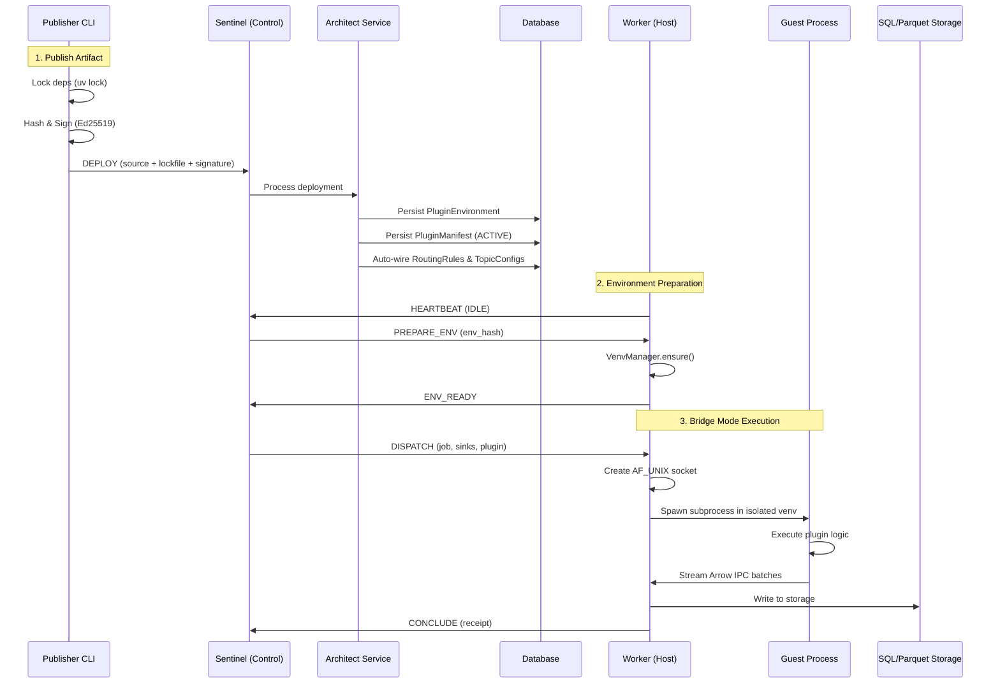

# Casparian Flow Architecture Guide (v5.0 - Bridge Mode)

A comprehensive mental model for the Casparian Flow system.

---

## High-Level Overview

Casparian Flow is an **Enterprise Artifact Registry with Bridge Mode Execution**. It turns "dark data" (files on disk) into structured, queryable datasets (SQL/Parquet) through a distributed, isolated execution architecture.

**Core Principles:**
1. **Bridge Mode Execution:** Host/Guest privilege separation via isolated virtual environments
2. **Pull-Based Processing:** Workers explicitly request jobs when ready (load balancing)
3. **Immutable Versioning:** Every file change creates a new version; jobs process specific versions
4. **Code-First Configuration:** Plugin source code is the source of truth for routing and schemas
5. **Publish-to-Execute Lifecycle:** Artifacts are signed, deployed, and auto-wired to the pipeline

---

## Directory Structure

### Rust Core (Control Plane)
```
crates/
├── casparian/             # Unified binary entry point
│   └── src/
│       ├── main.rs        # CLI: start, publish commands
│       ├── runtime.rs     # Split Tokio runtime (control/data)
│       └── server.rs      # Sentinel server implementation
├── cf_security/           # Authentication & validation (Rust)
│   └── src/
│       ├── azure.rs       # Azure AD Device Code Flow
│       ├── gatekeeper.rs  # AST-based validation
│       └── signing.rs     # Ed25519 signatures
└── cf_protocol/           # Binary protocol definitions
    └── src/
        └── lib.rs         # OpCodes, serialization
```

### Python Runtime (Data Plane)
```
src/casparian_flow/
├── config.py              # Global Pydantic settings
├── sdk.py                 # User-facing BasePlugin API
├── main.py                # Legacy entry point (deprecated)
├── protocol.py            # Binary Protocol v5 (Bridge Mode OpCodes)
├── mcp_server.py          # MCP Server for LLM Integration
├── db/
│   ├── models.py          # SQLAlchemy Models (The Source of Truth)
│   ├── access.py          # DB Engine & Bulk Loaders
│   └── setup.py           # Schema Fingerprinting & Init
├── engine/
│   ├── sentinel.py        # Legacy Python Sentinel (deprecated)
│   ├── worker_client.py   # Worker (Data Plane)
│   ├── bridge.py          # Host-side execution bridge
│   ├── bridge_shim.py     # Guest process in isolated venv
│   ├── venv_manager.py    # Isolated venv lifecycle
│   ├── queue.py           # Atomic Job Queue
│   └── sinks.py           # Output Adapters (Parquet/SQLite/MSSQL)
├── services/
│   ├── scout.py           # Discovery Service (Inventory + Tagger)
│   ├── architect.py       # Plugin Deployment & Governance
│   └── ...                # Additional services
└── ui/
    └── app.py             # FastHTML UI Application
```

---

## Process Architecture: Bridge Mode

Casparian Flow v5.0 introduces **Bridge Mode** - a Host/Guest privilege separation model for secure, isolated plugin execution.



### Components

**1. Publisher CLI (`crates/casparian/src/main.rs publish`)**
* **Role:** End-to-end artifact publishing (Rust implementation)
* **Workflow:**
  1. Discovery: Finds `pyproject.toml` or `uv.lock`
  2. Locking: Runs `uv lock --universal` for cross-platform deps
  3. Hashing: Computes `env_hash` (lockfile) and `artifact_hash` (source + lockfile)
  4. Authentication: Local API key or Azure AD Device Code Flow (via `cf_security::AzureProvider`)
  5. Signing: Ed25519 signature of artifact (via `cf_security::signing`)
  6. Upload: Sends `DEPLOY` OpCode to Sentinel

**2. Sentinel (`crates/casparian/src/server.rs` - Rust)**
* **Role:** The "Brain". Manages Job Queue and Worker orchestration.
* **Implementation:** Rust with split Tokio runtime (control/data planes)
* **Responsibility:**
  * Tracks connected workers and their capabilities
  * Matches pending jobs to idle workers
  * Routes `DEPLOY` messages to Architect
  * Handles environment preparation via `PREPARE_ENV`/`ENV_READY`
* **No Data:** Does *not* touch the data payload

**3. Architect Service (`services/architect.py`)**
* **Role:** Plugin deployment lifecycle ("Publish-to-Execute")
* **Responsibility:**
  * Receives deployment requests from Sentinel
  * Persists `PluginEnvironment` (lockfile → content-addressable storage)
  * Persists `PluginManifest` with ACTIVE status
  * Extracts metadata via AST parsing (Data-Oriented Design - no execution)
  * Auto-wires database: RoutingRules, PluginConfigs, TopicConfigs

**4. Worker (Host Process)**
* **Role:** The "Muscle". Privileged compute node.
* **Responsibility:**
  * Holds credentials: AWS keys, DB passwords, heavy drivers (pyodbc)
  * Manages `VenvManager` for isolated environments
  * Creates AF_UNIX socket for Guest IPC
  * Receives Arrow IPC batches from Guest
  * Writes to configured Sinks (Parquet, SQL, MSSQL)
  * Reports `JobReceipt` to Sentinel

**5. Guest Process (BridgeShim)**
* **Role:** Sandboxed plugin execution
* **Responsibility:**
  * Runs in isolated virtual environment
  * Minimal dependencies: pandas, pyarrow only
  * No credentials, no heavy drivers
  * Receives plugin code and file path via environment
  * Streams Arrow IPC batches to Host via socket
  * Minimal attack surface

**6. VenvManager (`engine/venv_manager.py`)**
* **Role:** Virtual environment lifecycle
* **Features:**
  * Creates isolated venvs per `env_hash`
  * Uses `uv` for fast, reproducible installs
  * LRU eviction for disk space management
  * Hardlinking for deduplication
  * Content-addressable storage: `~/.casparian_flow/venvs/{env_hash}/`

---

## Execution Architecture

### Bridge Mode (v5.0 - Only Mode)
```
Worker (Host) <-- AF_UNIX --> Guest Process (isolated venv)
     |                              |
     v                              v
   Sinks                    Plugin Execution
```
* **All** plugins run in isolated venv subprocesses
* Uses `uv.lock` for reproducible dependencies (auto-generated if missing)
* Host holds credentials/drivers
* Guest streams data via Arrow IPC
* Complete isolation, full dependency control
* Lineage tracking via `file_version_id` passed through environment

---

## Protocol v5 (OpCodes)

Binary header format: `!BBHQI` (16 bytes)
- Version (1 byte), OpCode (1 byte), Reserved (2 bytes), JobID (8 bytes), Length (4 bytes)

| OpCode | Name | Direction | Purpose |
|--------|------|-----------|---------|
| 1 | `IDENTIFY` | Worker → Sentinel | Handshake with capabilities |
| 2 | `DISPATCH` | Sentinel → Worker | Job command with sink configs |
| 3 | `ABORT` | Sentinel → Worker | Cancel job |
| 4 | `HEARTBEAT` | Worker → Sentinel | Keep-alive / Status |
| 5 | `CONCLUDE` | Worker → Sentinel | Job finished + Receipt |
| 6 | `ERR` | Bidirectional | Error reporting |
| 8 | `PREPARE_ENV` | Sentinel → Worker | Provision isolated environment |
| 9 | `ENV_READY` | Worker → Sentinel | Environment ready for use |
| 10 | `DEPLOY` | Publisher → Sentinel | Deploy artifact |

---

## Discovery Architecture: The Split Scout

Discovery is decoupled into **I/O** and **Logic** phases to handle millions of files efficiently.

### 1. Inventory Scanner (Fast I/O)
* **Goal:** Mirror the filesystem state to the Database
* **Action:** Walks directories using `ParallelFileScanner`
* **Updates:** `FileLocation` table (path, filename, `last_known_mtime`, `last_known_size`)
* **Constraint:** Never reads file content. Never hashes. Extremely fast.

### 2. Tagger Service (Logic & CPU)
* **Goal:** Determine what needs processing
* **Action:** Polls DB for "Dirty" files
  * *Dirty Criteria:* `FileLocation.last_known_mtime` != `FileVersion.modified_time`
* **Processing:**
  1. Calculates SHA-256 Hash
  2. Creates immutable `FileVersion`
  3. Matches path against `RoutingRule`s
  4. Applies Tags
  5. Queues `ProcessingJob` if tags match a `PluginConfig`

---

## Data Models

### Core Models

| Model | Purpose |
|-------|---------|
| `SourceRoot` | Root directory being watched |
| `FileLocation` | Mutable record of a file path on disk + Inventory state |
| `FileVersion` | Immutable snapshot of content (SHA-256) + Tags |
| `ProcessingJob` | Unit of work linking a Version to a Plugin |
| `RoutingRule` | Glob Pattern (`*.csv`) → Tag (`finance_data`) |
| `PluginConfig` | Plugin settings + Subscription (`finance_data`) |
| `TopicConfig` | Logical Topic (`sales`) → Physical URI (`sqlite:///sales.db`) |

### v5.0 New Models

| Model | Purpose |
|-------|---------|
| `Publisher` | Audit trail: azure_oid, name, email, last_active |
| `PluginEnvironment` | Content-addressable lockfile storage (hash → lockfile_content) |
| `PluginManifest` | Extended with `env_hash`, `artifact_hash`, `publisher_id`, `system_requirements` |

### PluginManifest Status Enum

```python
PENDING = "PENDING"      # Awaiting review
STAGING = "STAGING"      # Intermediate state
ACTIVE = "ACTIVE"        # Ready for execution
REJECTED = "REJECTED"    # Blocked
```

---

## Security Architecture

### Dual-Mode Strategy (Rust Implementation)

All security primitives implemented in `crates/cf_security/`:

**Local Mode (Development)**
* Zero friction, auto-generated Ed25519 keys
* Implicit trust for rapid iteration
* Implementation: `cf_security::signing::generate_keypair()`

**Enterprise Mode (Production)**
* Zero trust, Azure AD integration (raw HTTP, no SDK dependencies)
* JWT validation, audit trails
* Device Code Flow for CLI authentication
* Implementation: `cf_security::azure::AzureProvider`
* Real Azure tests: `cargo test -p cf_security --test test_azure_real -- --ignored`

### Artifact Security

1. **Signing:** Ed25519 signatures on all artifacts (`cf_security::signing`)
2. **Hashing:** SHA-256 of (source + lockfile) = `artifact_hash`
3. **Gatekeeper:** AST validation using `rustpython-parser` (banned imports: `os`, `subprocess`)
4. **Isolation:** Guest process has no credentials

---

## Configuration (Code-First)

Plugins configure the system via `MANIFEST` in their source code. The Architect extracts this via AST parsing (no execution).

```python
# plugins/my_parser.py
from casparian_flow.sdk import BasePlugin, PluginMetadata

MANIFEST = PluginMetadata(
    pattern="*.csv",           # Auto-creates RoutingRule
    topic="sales_data",        # Auto-creates TopicConfig
    priority=50,               # Routing priority
    subscriptions=["csv"]      # Input topic subscriptions
)

class Handler(BasePlugin):
    def execute(self, path):
        # ...
        self.publish("sales_data", df)
```

---

## Integrity & Lineage

1. **Lineage:** Every row in output includes `_job_id` and `_file_version_id`, traceable to exact source file hash
2. **Gatekeeper:** AI-generated code passes through AST validation and signature verification
3. **Concurrency:** Output files use unique job-IDs to prevent race conditions
4. **Atomic Promotion:** Data is written to `_stg` tables, promoted to production only on success
5. **Audit Trail:** `Publisher` model tracks who deployed what and when
