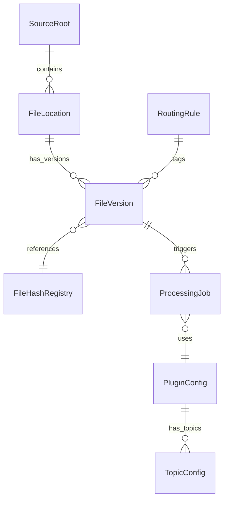
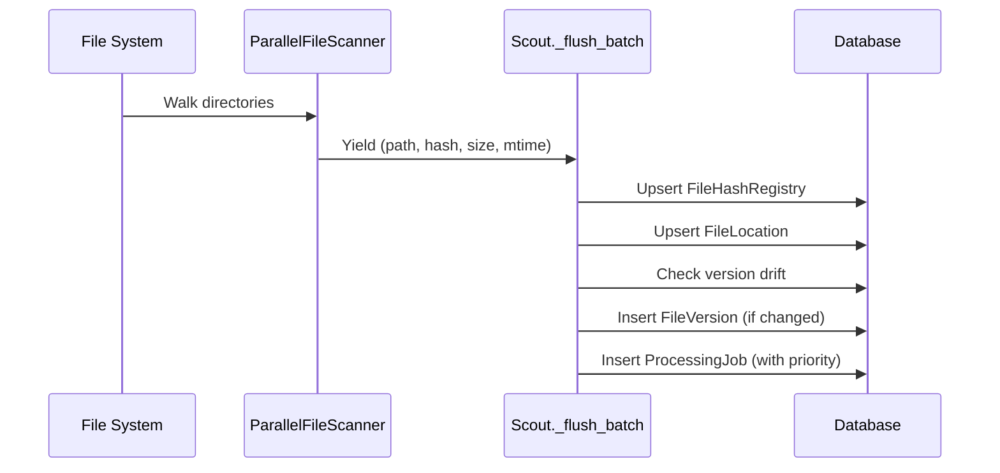
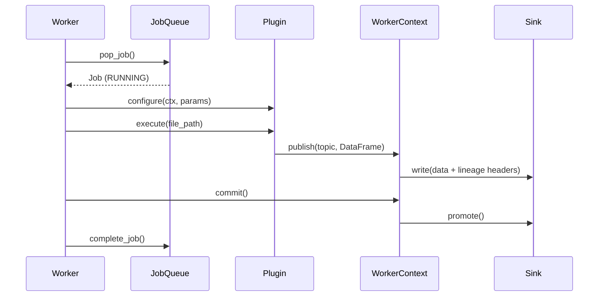

# Casparian Flow Architecture Guide

A mental model for understanding the entire codebase.

---

## High-Level Overview

Casparian Flow is a **file-to-database pipeline** that watches directories, detects file changes, and transforms them into structured data.


**Core principle**: Files flow through the system immutably. Every file version is tracked, every job is auditable.

---

## Directory Structure

```
src/casparian_flow/
├── config.py          # Pydantic settings from TOML
├── context.py         # EtlContext (git hash, env info)
├── sdk.py             # BasePlugin class for user plugins
├── interface.py       # CaspPlugin protocol definition
├── main.py            # Entry point
├── db/
│   ├── models.py      # SQLAlchemy data models (THE HEART)
│   ├── base_session.py# SessionLocal factory
│   ├── access.py      # Engine creation, bulk upload
│   └── setup.py       # DB initialization, schema fingerprinting
├── engine/
│   ├── worker.py      # Job processor (Worker loop)
│   ├── queue.py       # JobQueue (pop/complete/fail)
│   ├── context.py     # WorkerContext (lineage injection)
│   ├── sinks.py       # Parquet/SQLite/MSSQL outputs
│   ├── heartbeat.py   # Worker node heartbeat
│   └── config.py      # WorkerConfig dataclass
├── services/
│   ├── scout.py       # File scanner (CORE LOGIC)
│   └── fs_engine.py   # Parallel file walker
└── plugins/
    ├── loader.py      # PluginRegistry discovery
    └── test_plugin.py # Sample plugin
```

---

## The Data Models (The Heart)

All models live in `src/casparian_flow/db/models.py`. Understanding these is critical.

### Entity Relationship



### Key Models

| Model | Purpose | Primary Key |
|-------|---------|-------------|
| `SourceRoot` | A watched directory (e.g., `/data/invoices`) | `id` |
| `FileLocation` | A persistent path within a SourceRoot | `id` |
| `FileVersion` | Immutable snapshot of file content | `id` |
| `FileHashRegistry` | Deduplication registry (content-addressed) | `content_hash` |
| `ProcessingJob` | A unit of work in the queue | `id` |
| `PluginConfig` | Plugin settings + subscribed tags | `plugin_name` |
| `TopicConfig` | Output sink configuration per topic | `id` |
| `RoutingRule` | Pattern → Tag mapping (glob-based) | `id` |
| `WorkerNode` | Active worker heartbeat registry | `hostname + pid` |

### The Versioning Pattern

```
FileLocation (persistent path)
    └── FileVersion (immutable snapshot)
            └── content_hash → FileHashRegistry

When file changes:
1. Scout detects new hash
2. Creates NEW FileVersion (old one preserved)
3. Updates FileLocation.current_version_id
```

**Why?** Audit trail. Every job permanently references the exact file content it processed.

---

## The Scout (File Discovery)

`src/casparian_flow/services/scout.py` is the **entry point** for data into the system.

### Scan Flow



### Key Operations

1. **Hash Calculation**: SHA-256 of file content (64KB streaming)
2. **Version Drift Detection**: Compare `active_hashes[current_version_id]` vs new hash
3. **Tag Assignment**: Pattern matching via `RoutingRule` (glob syntax)
4. **QoS Priority**: Recent files (<24h) → priority 100, older → 10

### Scanner Architecture

`src/casparian_flow/services/fs_engine.py` uses a **producer-consumer pattern**:

```python
# Producer (background thread)
ThreadPool walks dirs → pushes to queue

# Consumer (generator)
Scout.scan_source() yields from queue
```

Backpressure limit: 10,000 items in queue.

---

## The Worker (Job Processing)

`src/casparian_flow/engine/worker.py` processes jobs from the queue.

### Worker Loop

```python
while active:
    job = queue.pop_job()  # Atomic claim
    if job:
        execute_job(job)   # Load plugin, run, commit
```

### Job Execution Flow



### Lineage Injection

Every row written to the sink gets **lineage headers**:

```python
data['_job_id'] = self.job_id
data['_file_version_id'] = self.file_version_id
data['_file_id'] = self.file_location_id
```

---

## The Queue (Job Management)

`src/casparian_flow/engine/queue.py` provides atomic job claims.

### SQLite Mode (Dev)
Simple query + update (no locking).

### MSSQL Mode (Production)
Atomic CTE with row locks:

```sql
WITH cte AS (
    SELECT TOP(1) * FROM queue 
    WITH (ROWLOCK, READPAST, UPDLOCK)
    WHERE status = 'QUEUED'
    ORDER BY priority DESC, id ASC
)
UPDATE cte SET status = 'RUNNING' ...
OUTPUT inserted.*;
```

---

## The Sinks (Output Writers)

`src/casparian_flow/engine/sinks.py` handles writing processed data.

### Supported Sinks

| URI Scheme | Destination | Example |
|------------|-------------|---------|
| `parquet://` | Parquet files | `parquet://./output` |
| `sqlite://` | SQLite table | `sqlite://data.db/table` |
| `mssql://` | SQL Server | `mssql://schema.table` |

### Staging Pattern (Blue/Green)

All sinks use staging for atomicity:

```
1. write() → staging table/file
2. promote() → move to production
3. On error: staging is discarded
```

---

## The Plugin System

### BasePlugin (`src/casparian_flow/sdk.py`)

```python
class BasePlugin:
    def configure(self, ctx, config):
        """System injects dependencies."""
        self._ctx = ctx
        
    def publish(self, topic: str, data: DataFrame):
        """User calls this to output data."""
        self._ctx.register_topic(topic)
        self._ctx.publish(handle, data)  # Lineage injected here
```

### Plugin Discovery (`src/casparian_flow/plugins/loader.py`)

1. Scans `plugins/` directory for `.py` files
2. Dynamically imports each module
3. Looks for `Handler` class
4. Caches in registry

### User Plugin Example

```python
from casparian_flow.sdk import BasePlugin
import pandas as pd

class Handler(BasePlugin):
    def execute(self, file_path: str):
        df = pd.read_csv(file_path)
        self.publish('output', df)
```

---

## Configuration System

### Global Config (`src/casparian_flow/config.py`)

Uses Pydantic Settings with TOML:

```toml
# global_config.toml
[database]
type = "sqlite3"
db_location = "casparian_flow.sqlite3"
```

### Worker Config (`src/casparian_flow/engine/config.py`)

```python
@dataclass
class WorkerConfig:
    database: DatabaseConfig
    storage: StorageConfig  
    plugins: PluginsConfig
```

---

## Integrity & Security

### Schema Fingerprinting (`src/casparian_flow/db/setup.py`)

The system uses **database-based schema fingerprinting** (not file hashing):

1. Query live database structure via SQLAlchemy inspector
2. Build canonical representation: `table:column:TYPE`
3. SHA-256 hash of the canonical string

```python
def compute_schema_fingerprint(engine) -> str:
    """Returns stable hash of database structure."""
    # Immune to whitespace/comment changes in code
```

### Database Integrity

Inspector validates all expected tables and columns exist.

---

## Data Flow Summary

```
┌─────────────────────────────────────────────────────────────────────┐
│                           SCOUT PHASE                               │
├─────────────────────────────────────────────────────────────────────┤
│  1. ParallelFileScanner walks SourceRoot directories               │
│  2. For each file: compute SHA-256 hash                            │
│  3. Check FileHashRegistry for deduplication                       │
│  4. Upsert FileLocation (path) and FileVersion (content)           │
│  5. Apply RoutingRules → assign tags                               │
│  6. Match tags to PluginConfig subscriptions                       │
│  7. Create ProcessingJob with QoS priority                         │
└─────────────────────────────────────────────────────────────────────┘
                              │
                              ▼
┌─────────────────────────────────────────────────────────────────────┐
│                          WORKER PHASE                               │
├─────────────────────────────────────────────────────────────────────┤
│  1. JobQueue.pop_job() atomically claims a QUEUED job              │
│  2. Resolve file path: FileVersion → FileLocation → SourceRoot     │
│  3. Load PluginConfig + TopicConfig from database                  │
│  4. Create WorkerContext with lineage metadata                     │
│  5. Plugin.execute() processes file, calls publish()               │
│  6. Sink writes to staging with injected lineage columns           │
│  7. On success: Sink.promote() moves staging → production          │
│  8. JobQueue.complete_job() marks job COMPLETED                    │
└─────────────────────────────────────────────────────────────────────┘
```

---

## Testing Strategy

| Test File | Focus |
|-----------|-------|
| `test_smoke.py` | End-to-end: Scout → Queue → Worker → Sink |
| `test_queue.py` | Priority ordering, atomic claims, completion |
| `test_worker.py` | Error handling, job failure marking |
| `test_heartbeat.py` | Worker crash handling |

Key fixtures in `conftest.py`:
- `temp_test_dir`: Isolated test data directory
- `test_db_engine`: Fresh SQLite per test
- `test_source_root`: Pre-configured SourceRoot ID
