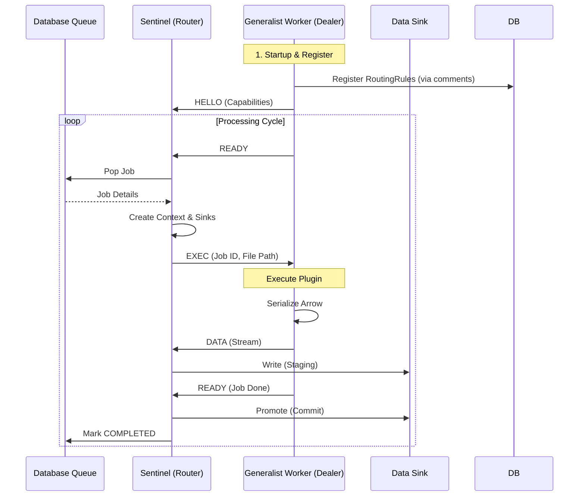

# Casparian Flow Architecture Guide (v3.0 - Pull Architecture)

A comprehensive mental model for the Casparian Flow system.

---

## High-Level Overview

Casparian Flow is an autonomous **file-to-data pipeline**. It turns "dark data" (files on disk) into structured, queryable datasets (SQL/Parquet) through a distributed, pull-based architecture.

**Core Principles:**
1.  **Pull-Based Processing:** Workers explicitly request jobs when ready (Load Balancing).
2.  **Immutable Versioning:** Every file change creates a new version; jobs process specific versions.
3.  **Code-First Configuration:** Plugin source code is the source of truth for routing and schemas.
4.  **Separation of Concerns:** I/O (Scanning) is decoupled from Logic (Tagging/Hashing).

---

## Directory Structure


```

src/casparian_flow/
├── config.py          # Global Pydantic settings
├── context.py         # Environmental Context (Host, User, GitHash)
├── sdk.py             # User-facing BasePlugin API
├── interface.py       # Internal Plugin Protocol
├── main.py            # Sentinel Entry Point
├── protocol.py        # Binary Protocol v3 (Hello/Ready/Exec)
├── mcp_server.py      # MCP Server for LLM Integration
├── db/
│   ├── models.py      # SQLAlchemy Models (The Source of Truth)
│   ├── access.py      # DB Engine & Bulk Loaders
│   └── setup.py       # Schema Fingerprinting & Init
├── engine/
│   ├── sentinel.py    # The Broker/Router (Manages Queue & Sinks)
│   ├── worker_client.py # The Generalist Worker (Executes Code)
│   ├── queue.py       # Atomic Job Queue
│   ├── context.py     # WorkerContext (Sink Management & Lineage)
│   ├── sinks.py       # Output Adapters (Parquet/SQLite/MSSQL)
│   └── config.py      # Engine Config Models
├── services/
│   ├── scout.py       # Discovery Service (Inventory + Tagger)
│   ├── fs_engine.py   # Parallel Directory Walker
│   ├── registrar.py   # Code-First Plugin Registration
│   ├── architect.py   # Plugin Deployment & Governance
│   ├── inspector.py   # File Profiling
│   ├── llm_generator.py # AI Code Generation
│   └── test_generator.py # AI Test Generation
├── agents/
│   └── surveyor.py    # Autonomous Onboarding Agent
└── security/
└── gatekeeper.py  # Static Analysis & Signatures

```

---

## Process Architecture: The Pull Model (Sentinel & Generalist)

Casparian Flow uses a **Router-Dealer** pattern over ZeroMQ to enable horizontal scaling and robust failure recovery.



### Components

1. **Sentinel (The Router)**
* **Role:** The "Brain". Manages the Job Queue, Worker State, and Output Sinks.
* **Responsibility:**
* Tracks connected workers and their capabilities.
* Matches pending jobs to idle workers.
* **Governance:** Validates incoming data streams against schema contracts.
* **Writes:** Owns the connection to the Sinks (SQL/Parquet). All data flows back to the Sentinel for writing.


2. **Generalist Worker (The Dealer)**
* **Role:** The "Muscle". Pure compute node.
* **Responsibility:**
* Scans its local `plugins/` directory.
* **Auto-Registration:** Parsers source code for `# PATTERN:` and `# TOPIC:` to configure the DB.
* Executes user code in a loop.
* **Proxy Context:** Intercepts `self.publish()` calls and streams Zero-Copy Arrow IPC data back to the Sentinel.


3. **Protocol v3**
* **Format:** Fixed 16-byte binary header (`!BBHIQ`) + Payload.
* **OpCodes:**
* `HELLO (1)`: Handshake with capabilities.
* `EXEC (2)`: Command to process a file.
* `DATA (3)`: Arrow IPC stream payload.
* `READY (4)`: "I am idle" / "Job finished" signal.
* `ERR (5)`: Error reporting.


---

## Discovery Architecture: The Split Scout

Discovery is decoupled into **I/O** and **Logic** phases to handle millions of files efficiently.

### 1. Inventory Scanner (Fast I/O)

* **Goal:** Mirror the filesystem state to the Database.
* **Action:** Walks directories using `ParallelFileScanner`.
* **Updates:** `FileLocation` table (path, filename, `last_known_mtime`, `last_known_size`).
* **Constraint:** Never reads file content. Never hashes. Extremely fast.

### 2. Tagger Service (Logic & CPU)

* **Goal:** Determine what needs processing.
* **Action:** Polls DB for "Dirty" files.
* *Dirty Criteria:* `FileLocation.last_known_mtime` != `FileVersion.modified_time`.


* **Processing:**
1. Calculates SHA-256 Hash.
2. Creates immutable `FileVersion`.
3. Matches path against `RoutingRule`s.
4. Applies Tags.
5. Queues `ProcessingJob` if tags match a `PluginConfig`.


---

## Detailed Workflows

### Workflow A: The Discovery Loop (Scout)

1. **Scan:** `InventoryScanner` walks `SourceRoot`. Upserts `FileLocation` records.
2. **Detect:** `TaggerService` queries for files where the inventory `mtime` differs from the current version.
3. **Hash:** Tagger computes content hash (SHA-256). checks `FileHashRegistry` for deduplication.
4. **Version:** Creates a new `FileVersion` linked to the location.
5. **Route:** Checks `RoutingRule` table (e.g., `*.csv` -> `csv_tag`). Saves tags to `FileVersion`.
6. **Queue:** Checks `PluginConfig` subscriptions. If tags match, inserts `ProcessingJob` with QoS priority.

### Workflow B: The Processing Loop (Pull)

1. **Connect:** Generalist Worker connects to Sentinel. Sends `HELLO`.
2. **Request:** Worker sends `READY`.
3. **Dispatch:** Sentinel receives `READY`.
* Checks `idle_workers`.
* Pops highest priority Job from `JobQueue`.
* Matches Job Plugin -> Worker Capabilities.


4. **Context:** Sentinel initializes `WorkerContext` and opens Staging Sinks (e.g., `table_stg_123`).
5. **Execute:** Sentinel sends `EXEC` to Worker.
6. **Stream:** Worker runs plugin. `ProxyContext` intercepts data, serializes to Arrow, sends `DATA` frames.
7. **Write:** Sentinel receives `DATA`, writes to Staging Sink.
8. **Commit:** Worker finishes, sends `READY`.
* Sentinel calls `sink.promote()` (Atomic swap/insert to production).
* Sentinel marks Job `COMPLETED`.


### Workflow C: The Surveyor Agent (Autonomous Onboarding)

A generic agent that sets up the pipeline for you.

1. **Reconnaissance:** Queries DB for unindexed files. Picks a sample.
2. **Environment:** Checks `LibraryWhitelist` for available tools.
3. **Construction:**
* **Inspect:** Profiles file header/structure.
* **Draft:** LLM proposes schema/plugin logic.
* **Build:** LLM generates Python plugin code.
* **Deploy:** Submits code to Architect.


4. **Wiring:** Auto-creates `RoutingRule` (e.g., `*.xml` -> `xml_parser`) and `TopicConfig`.
5. **Verification:** Waits for a `ProcessingJob` to succeed.
6. **Test Gen:** Generates a `pytest` file for the new plugin.

---

## Data Models

| Model | Purpose |
| --- | --- |
| `SourceRoot` | Root directory being watched. |
| `FileLocation` | Mutable record of a file path on disk + Inventory state. |
| `FileVersion` | Immutable snapshot of content (SHA-256) + Tags. |
| `ProcessingJob` | Unit of work linking a Version to a Plugin. |
| `RoutingRule` | Glob Pattern (`*.csv`) -> Tag (`finance_data`). |
| `PluginConfig` | Plugin settings + Subscription (`finance_data`). |
| `TopicConfig` | Logical Topic (`sales`) -> Physical URI (`sqlite:///sales.db`). |
| `PluginManifest` | Registry of source code for managed/AI plugins. |
| `SurveyorSession` | State tracking for autonomous agent runs. |

---

## Configuration (Code-First)

Plugins configure the system via "Magic Comments" in their source code. The Worker reads these on startup and updates the Database.

```python
# plugins/my_parser.py

# PATTERN: *.csv           <-- Auto-creates RoutingRule
# TOPIC: sales_data        <-- Auto-creates TopicConfig (Default Parquet)

from casparian_flow.sdk import BasePlugin

class Handler(BasePlugin):
    def execute(self, path):
        # ...
        self.publish("sales_data", df)

```

---

## Integrity & Security

1. **Lineage:** Every row in the output DB includes `_job_id` and `_file_version_id`, traceable back to the exact source file hash.
2. **Gatekeeper:** AI-generated code passes through AST validation (banned imports like `os`, `subprocess`) and HMAC signature verification before running.
3. **Atomic Promotion:** Data is written to `_stg` tables. It is only moved to production tables if the job completes successfully.
