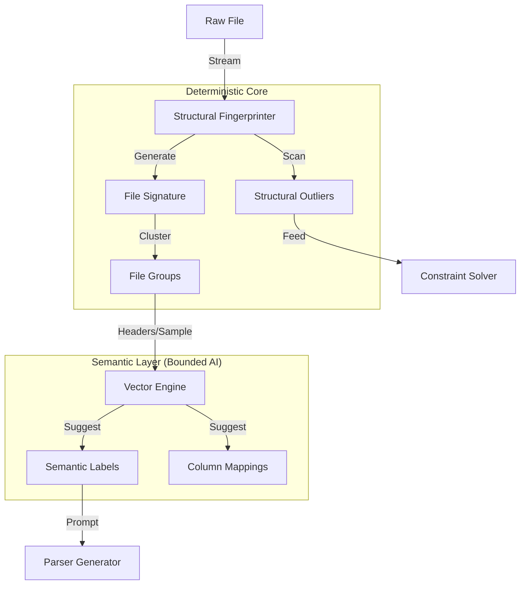

# Product Specification: Casparian Discovery Intelligence (Phase 2)

**Version:** 0.4 (Spec Refinement v2 - Gap Analysis Complete)
**Status:** Conceptual / Research
**Target Component:** Scout Subsystem (Discovery & Sampling)
**Key Technology:** Structural Fingerprinting (Deterministic) + Vector Search (Semantic Layer)

---

## 1. Executive Summary

**Discovery Intelligence** is the Phase 2 upgrade for Casparian Flow. It introduces a **Structure-First** architecture for handling dark data at scale.

While AI and Vector Search are powerful, data engineering requires precision. This spec defines a system that uses **Deterministic Fingerprinting** to group files and detect errors, while **bounding** the use of Probabilistic Vector Search (LEANN) to the tasks it excels at: semantic labeling and column mapping.

### 1.1 The Core Philosophy: "Structure is Truth"
*   **Fact:** A file with `[Int, Date]` columns is structurally different from `[Int, String]`, regardless of semantic similarity.
*   **Approach:** We use structural analysis (Type Masks, Delimiters) to group files and find outliers. We use AI only to *explain* or *map* those structures to human concepts.

---

## 2. Architecture: The Structural Scout



### 2.1 Component Roles

| Component | Role | Logic | Output |
| :--- | :--- | :--- | :--- |
| **Structural Engine** | **The Classifier** (Deterministic) | "Does this row match the expected Type Mask?" | Signatures, Outlier Rows |
| **Vector Engine** | **The Translator** (Probabilistic) | "Does 'txn_dt' mean 'Transaction Date'?" | Suggested Mappings/Tags |
| **Constraint Solver** | **The Judge** (Deterministic) | "What is the strict type of this column?" | `DataType` Contract |

---

## 3. Functional Specifications

### FS-1: Structural Fingerprinting (The Grouper)
*   **Goal:** Deterministically group 10,000 files by format.
*   **Mechanism:**
    1.  Read first 1KB of file.
    2.  Detect format (CSV/JSON/XML) and delimiter.
    3.  Extract Header Set (e.g., `["id", "date"]`).
    4.  Generate **Type Mask** of first 10 rows (e.g., `[Int, Date(ISO)]`).
*   **Signature:** `Hash(Format + Headers + TypeMask)`.
*   **Clustering:** Group files with identical Signatures.
*   **Reliability:** 100%. Files in a group are guaranteed to be parseable by the same logic.

### FS-2: Structural Outlier Detection (The Hunter)
*   **Goal:** Find the row that crashes the parser (e.g., string in int column).
*   **Mechanism:**
    1.  Establish **LUB Type Mask** for the file (computed from sample).
    2.  Stream the file (no embedding required).
    3.  **Trigger:** If a row's type mask cannot be unified with the LUB, flag it.
    4.  **Sampling:** Return the top 5 most deviant Structural Outliers to the Parser Lab.
*   **Performance:** Ultra-fast (byte scanning). No ML model overhead.

### FS-3: Semantic Mapping (The Mapper)
*   **Goal:** Map diverse headers to a target schema.
*   **Mechanism (Vector Search):**
    1.  User defines Target Schema: `[Transaction_Date, Amount]`.
    2.  System sees File Header: `[txn_dt, cost]`.
    3.  Vector Engine computes similarity: `Sim("txn_dt", "Transaction_Date") > 0.9`.
    4.  **Proposal:** "Map `txn_dt` → `Transaction_Date`?"
*   **Bounding:** The user *confirms* the map. The fuzzy guess becomes a hard renaming rule in the generated parser.

### FS-4: Semantic Labeling (The Librarian)
*   **Goal:** Organize file groups with human-readable names.
*   **Mechanism:**
    1.  Take headers + top 5 text values from a File Group.
    2.  Vector Search / LLM classifies them: "Looks like 'Invoice Data'".
    3.  **Proposal:** "Tag these 50 files as 'Invoices'?"

---

## 4. User Experience (UX)

### 4.1 The "Deep Scan" Command
Now emphasizes structural integrity.

```bash
$ casparian scan ./data/ --deep

> Scanned 150 files.
> Grouped into 3 Format Signatures:

  [Group A] (120 files)
  • Signature: CSV, [id, date, amt], [Int, Date, Float]
  • Semantic Guess: "Sales Records"
  • Anomaly Check: ✓ Consistent

  [Group B] (29 files)
  • Signature: CSV, [id, date, amt], [Int, String, Float]
  • ⚠️ Anomaly: Date column drifted to String in these files.
  • Action: Inspect specific files?

  [Group C] (1 file)
  • Signature: Binary/Unknown
  • Action: Skip or manual inspect?
```

### 4.2 The "Auto-Map" Interface
When generating a parser for a new file against an existing schema:

```bash
$ casparian parser generate sales_schema.json ./new_data.csv

> Analyzing structure... Match (CSV).
> Analyzing headers... Mismatch.
  • Expected: [transaction_id, total]
  • Found:    [txn_num, final_amt]

> [AI] Semantic analysis suggests:
  • txn_num   → transaction_id (98% confidence)
  • final_amt → total          (95% confidence)

> Apply these mappings? [Y/n]
```

---

## 5. Implementation Strategy

### Phase 2.1: The Fingerprint Engine (Rust)
*   Implement `sniffer` module in `casparian_worker`.
*   Fast heuristic detection of types (`is_int`, `is_date`, `is_json`).
*   Compute signatures during `quick_scan`.

### Phase 2.2: The Semantic Sidecar (Python/LEANN)
*   **Optional:** Only runs if user installs the extension.
*   **Inputs:** Metadata and small text samples (not full files).
*   **Outputs:** Tags and Mapping suggestions.
*   **Model:** Small quantized model (e.g., `all-MiniLM-L6-v2-quant`).

---

## 6. Constraints & Boundaries

*   **Vector Isolation:** Vectors are NEVER used to decide *how* to parse a specific row (too risky). They are ONLY used to *organize* files and *suggest* mappings.
*   **Fallback:** If the Semantic Sidecar is missing, the system still groups files perfectly by Structure (Group A, Group B), just without the "Sales Records" label.

---

## 7. Fingerprint Engine Specification

### 7.1 Format Detection

The fingerprinter examines the first 4KB of a file to determine format:

```
Priority Order:
1. Magic bytes check (Parquet: PAR1, ZIP: PK, etc.)
2. JSON detection: starts with { or [
3. XML detection: starts with <? or <
4. NDJSON detection: multiple lines, each valid JSON
5. Delimiter sniffing for tabular data
6. Fallback: Binary/Unknown
```

**Delimiter Sniffing Algorithm:**
```
1. Read first 5 lines (excluding empty/comment lines)
2. For each candidate delimiter [',', '\t', '|', ';']:
     count[d] = number of occurrences per line
3. Winner = delimiter with:
     - Consistent count across all lines (std_dev < 1)
     - Highest count
4. If no winner: treat as single-column or unstructured
```

### 7.2 Type Detection Rules

Types are detected in **priority order** (first match wins):

| Priority | Type | Detection Rule | Examples |
|----------|------|----------------|----------|
| 1 | **Null** | Empty or null pattern | `""`, `NULL`, `null`, `N/A`, `NA`, `-`, `None` |
| 2 | **Boolean** | Boolean pattern (case-insensitive) | `true`/`false`, `yes`/`no`, `1`/`0`, `T`/`F` |
| 3 | **Int64** | `^-?\d{1,18}$` | `123`, `-456`, `0` |
| 4 | **Float64** | `^-?\d+\.\d+$` or scientific | `3.14`, `-0.5`, `1.23e-4` |
| 5 | **Date(ISO)** | `^\d{4}-\d{2}-\d{2}$` | `2024-01-15` |
| 6 | **DateTime** | Date + `T` or space + time pattern | `2024-01-15T10:30:00Z` |
| 7 | **Date(SlashUS)** | Slash format with **proof** of US (day>12) | `12/25/2024` (25 proves day position) |
| 8 | **Date(SlashEU)** | Slash format with **proof** of EU (month>12 impossible) | `25/12/2024` (25 proves day position) |
| 9 | **Date(SlashAmbiguous)** | Slash format, all values ≤12 | `01/02/2024` (could be Jan 2 or Feb 1) |
| 10 | **UUID** | `^[0-9a-f]{8}-[0-9a-f]{4}-...` | `550e8400-e29b-41d4-a716-446655440000` |
| 11 | **Email** | Contains `@` with valid structure | `user@example.com` |
| 12 | **URL** | Starts with `http://` or `https://` | `https://example.com/path` |
| 13 | **JSON** | Valid JSON object or array | `{"key": "value"}`, `[1,2,3]` |
| 14 | **String** | Fallback for everything else | Any text |
| 15 | **Unknown** | Column has only nulls in sample | (requires more data) |

**Date Format Resolution (Constraint-Based):**

For slash-formatted dates (`MM/DD/YYYY` vs `DD/MM/YYYY`), we use **elimination** not voting:

```
Algorithm: ResolveDateFormat(column_values)

1. For each value in column:
     Parse as A/B/YYYY
     If A > 12: PROVES format is DD/MM (EU) - A cannot be month
     If B > 12: PROVES format is MM/DD (US) - B cannot be month

2. If ANY value proves US → Column is Date(SlashUS)
   If ANY value proves EU → Column is Date(SlashEU)
   If CONFLICT (both proved) → Column is String (invalid data)
   If NO proof → Column is Date(SlashAmbiguous)
```

**Example:**
```
01/02/2024  → Ambiguous (both ≤ 12)
03/04/2024  → Ambiguous (both ≤ 12)
13/04/2024  → PROVES EU (13 > 12, must be day)
Result: Entire column is Date(SlashEU)
```

**Type Lattice (for LUB computation):**

```
         String (top - everything can be string)
            │
    ┌───────┼───────┬─────────┐
    │       │       │         │
  Float64  Date*   JSON    Unknown**
    │       │
  Int64  DateTime
    │
 Boolean
    │
  Null (bottom)

* Date types collapse: Date(SlashUS), Date(SlashEU), Date(SlashAmbiguous) → Date(Slash)
** Unknown = column with only nulls in sample (flags for review, not a parsing type)
```

**Type Mask Representation:**
```
Compact: "INFDsss"  (Int, Null, Float, Date, String, String, String)
Verbose: ["Int64", "Null", "Float64", "Date(ISO)", "String", "String", "String"]
```

### 7.3 Signature Computation

```
Algorithm: ComputeSignature(file)

Input: File path
Output: SignatureHash, SignatureComponents

1. FORMAT = detect_format(file)
2. If FORMAT == Binary/Unknown:
     Return Hash("BINARY:" + file_extension + ":" + magic_bytes[:8])

3. ENCODING = detect_encoding(first_4kb)  # See §7.5 for simplified rules
4. DELIMITER = sniff_delimiter(file) if tabular else None

5. HEADERS = extract_headers(file)
   - If first row has all-String types and subsequent rows differ: use as headers
   - If first row matches data pattern: headerless (use col_0, col_1, ...)
   - Normalize: lowercase, strip whitespace

6. SAMPLE_ROWS = adaptive_sample(file, target=30)
   - Always: Rows 1-10 (head)
   - If seekable: Rows at ~50% position (middle sample)
   - If seekable AND file < 100MB: Last 10 rows (tail)
   - If not seekable (stdin, gzip, network): Head only + warning

7. TYPE_MASK = lub_type_mask(SAMPLE_ROWS)  # ← CHANGED: LUB not Modal
   - For each column: compute Least Upper Bound of all observed types
   - Uses Type Lattice from §7.2
   - Guarantees: deterministic regardless of sample distribution

8. SIGNATURE_COMPONENTS = {
     format: FORMAT,
     encoding: ENCODING,
     delimiter: DELIMITER,
     headers: sorted(HEADERS),
     type_mask: TYPE_MASK,
     column_count: len(HEADERS)
   }

9. SIGNATURE_HASH = blake3(serialize_signature(SIGNATURE_COMPONENTS))

10. Return (SIGNATURE_HASH, SIGNATURE_COMPONENTS)
```

**LUB Type Mask Algorithm (Replaces Modal):**

```
Algorithm: lub_type_mask(rows)

Input: List of sampled rows
Output: Type mask with one type per column

For each column_index:
    observed_types = set()

    For each row in rows:
        cell_type = detect_type(row[column_index])
        observed_types.add(cell_type)

    # Compute LUB using Type Lattice
    result_type = Null  # Start at bottom
    For each t in observed_types:
        result_type = LUB(result_type, t)

    type_mask[column_index] = result_type

Return type_mask

# LUB rules (from Type Lattice):
LUB(Null, X) = X                    # Null is bottom
LUB(Int64, Float64) = Float64       # Widening
LUB(Int64, String) = String         # Incompatible → String
LUB(Date(ISO), Date(Slash*)) = String  # Different formats → String
LUB(Date(SlashUS), Date(SlashEU)) = String  # Conflict → String
LUB(Date(SlashUS), Date(SlashAmbiguous)) = Date(SlashUS)  # Proof wins
LUB(Date(SlashEU), Date(SlashAmbiguous)) = Date(SlashEU)  # Proof wins

# Special case: All-null column
If observed_types == {Null}:
    result_type = Unknown  # Flag for review, not a parsing decision
```

**Why LUB, Not Modal:**
```
Example: Column with 50% Int, 50% Float

Modal (OLD - WRONG):
  - Mode could be Int or Float depending on sample
  - Non-deterministic signature!

LUB (NEW - CORRECT):
  - LUB(Int, Float) = Float
  - Always Float, regardless of distribution
  - Deterministic signature ✓
```

**Signature Serialization (Deterministic):**

To ensure identical signatures across implementations, use this exact serialization:

```
Algorithm: serialize_signature(components)

1. Create ordered list of key-value pairs (alphabetical by key):
   [
     ("column_count", int_to_string(column_count)),
     ("delimiter", delimiter or ""),
     ("encoding", encoding),
     ("format", format),
     ("headers", join(sorted(headers), "|")),
     ("type_mask", join(type_mask, "|"))
   ]

2. Concatenate as: "key1=value1\nkey2=value2\n..."

3. Return UTF-8 bytes of concatenated string
```

**Example serialization:**
```
column_count=4
delimiter=,
encoding=utf-8
format=csv
headers=amount|date|id|name
type_mask=Float64|Date(ISO)|Int64|String
```

This avoids JSON canonicalization issues entirely.

### 7.4 Outlier Detection Algorithm

```
Algorithm: DetectOutliers(file, lub_type_mask)

Input: File path, LUB Type Mask from signature
Output: List of OutlierReport

OUTLIERS = []
ROW_INDEX = 0

For each ROW in stream(file):
    ROW_INDEX += 1
    ROW_TYPE_MASK = [detect_type(cell) for cell in ROW]

    # Check if row types can be unified with LUB
    For each (col_idx, expected, actual) in zip(LUB_TYPE_MASK, ROW_TYPE_MASK):
        If NOT is_subtype(actual, expected):
            # actual cannot be promoted to expected
            OUTLIERS.append(OutlierReport {
                row_index: ROW_INDEX,
                column_index: col_idx,
                column_name: HEADERS[col_idx],
                expected_type: expected,
                actual_type: actual,
                actual_value: ROW[col_idx][:100],  # Truncate for safety
                deviation_class: classify_deviation(expected, actual)
            })

    # Early termination if too many outliers
    If len(OUTLIERS) > 1000:
        OUTLIERS.append(TruncationWarning)
        Break

Return sorted(OUTLIERS, by=deviation_severity, limit=50)
```

**Subtype Check (is_subtype):**
```
is_subtype(actual, expected) returns true if actual can be promoted to expected:
  - Null is subtype of everything
  - Int64 is subtype of Float64
  - Int64 is subtype of String
  - Float64 is subtype of String
  - Any Date variant is subtype of String
  - Type is always subtype of itself
```

**Deviation Classes:**
| Expected | Actual | Class | Severity |
|----------|--------|-------|----------|
| Int64 | String | `TYPE_COERCION_FAIL` | High |
| Date | String | `TYPE_COERCION_FAIL` | High |
| Float64 | Int64 | `TYPE_WIDENING` | Low |
| String | Null | `NULLABLE` | Medium |
| Any | Null | `NULLABLE` | Medium |

### 7.5 Edge Case Handling

**Comment Lines:**
```
Detection: Line starts with #, //, or --
Handling: Skip during type mask computation
Preservation: Store comment_prefix in signature for parser generation
```

**Quoted Multi-line Values:**
```
Detection: Unbalanced quotes at line end
Handling: Accumulate lines until quotes balanced
Limit: Max 10 lines per logical row (else treat as corrupt)
```

**Headerless Files:**
```
Detection: First row type mask matches subsequent rows
Handling: Generate synthetic headers (col_0, col_1, ...)
Flag: headerless=true in signature
```

**Empty and Minimal Files:**
```
Handling: Empty and minimal file edge cases

1. Empty file (0 bytes):
   - Return error: FILE_EMPTY
   - Signature: None (cannot compute)

2. Header-only file (headers but no data rows):
   - Signature: Computed from headers with empty type mask []
   - Flag: data_rows=0 in signature metadata
   - Warning: "No data rows found, type mask is empty"

3. Single-row file (1 data row):
   - Valid for fingerprinting
   - Warning: "Single row sample - types may not be representative"
   - Confidence reduced in metadata

4. Truncated/incomplete file:
   - Detect: Last row has fewer columns than header
   - Return partial signature with warning
   - Flag: truncated=true in signature metadata
   - Include row count where truncation detected
```

**Large File Handling:**
```
Memory Limits:
- Signature computation: Uses streaming, max 4KB buffer for header detection
- Outlier detection: Streams entire file, constant memory O(1)
- Max columns: 10,000 (returns error if exceeded)
- Max header name length: 1,000 chars (truncates with warning)

Files > 1GB:
- Adaptive sampling uses head-only (no seek for middle/tail)
- Progress reporting every 10% during outlier scan
- CLI flag: --stream-only to force head-only sampling on any file
```

**Corrupted Data Handling:**
```
1. Invalid UTF-8 sequences:
   - Replace with U+FFFD (replacement character)
   - Track invalid_byte_count in signature metadata
   - Warning if invalid_byte_count > 0.1% of file size

2. Malformed CSV (unbalanced quotes):
   - Max 10 continuation lines per logical row
   - Beyond 10: treat as corrupt, skip row, log warning
   - Flag: malformed_row_count in signature metadata

3. Binary data in text columns:
   - Detect: >10% non-printable characters in sample
   - Type: String (but flag as potentially_binary=true)
```

**Encoding Detection (Simplified):**

```
Algorithm: detect_encoding(bytes)

1. Check for BOM:
   - EF BB BF → UTF-8 (with BOM)
   - FF FE    → UTF-16 LE
   - FE FF    → UTF-16 BE

2. If no BOM, try UTF-8 strict:
   - If valid UTF-8 → encoding = "utf-8", confidence = HIGH
   - If invalid → continue

3. Fallback to UTF-8 with replacement:
   - encoding = "utf-8"
   - confidence = MEDIUM
   - Store invalid_byte_count for diagnostics

4. NEVER try Latin-1 detection (too error-prone)
   - Latin-1 always "succeeds" but may be wrong
   - If user knows it's Latin-1, they can override via CLI

Return: { encoding, confidence, invalid_byte_count }
```

**Rationale:**
- UTF-8 is ASCII-compatible (all ASCII files are valid UTF-8)
- Attempting Latin-1 detection causes more problems than it solves
- User can override with `--encoding latin-1` if needed

---

## 8. API Specifications (Archived)

### 8.1 Tool API (Pre-v1)

Note: This section is historical; tool-based APIs were removed from v1.

#### `fingerprint_file`

Compute structural signature for a single file.

```json
{
  "name": "fingerprint_file",
  "description": "Compute structural fingerprint and detect outliers in a file",
  "parameters": {
    "file_path": {
      "type": "string",
      "required": true,
      "description": "Path to the file to fingerprint"
    },
    "detect_outliers": {
      "type": "boolean",
      "default": true,
      "description": "Whether to scan for structural outliers"
    },
    "outlier_limit": {
      "type": "integer",
      "default": 50,
      "description": "Maximum outliers to return"
    },
    "sample_rows": {
      "type": "integer",
      "default": 30,
      "description": "Number of rows to sample for type detection (head + middle + tail)"
    },
    "encoding": {
      "type": "string",
      "description": "Force specific encoding (e.g., 'utf-8', 'latin-1'). Auto-detected if not specified."
    }
  },
  "returns": {
    "signature_hash": "string - Blake3 hash of signature",
    "signature": {
      "format": "string - csv|json|parquet|xml|ndjson|binary",
      "encoding": "string - utf-8|latin-1|utf-16",
      "delimiter": "string|null",
      "headers": "string[] - Column names",
      "type_mask": "string[] - Type per column",
      "column_count": "integer",
      "headerless": "boolean"
    },
    "outliers": [{
      "row_index": "integer",
      "column_name": "string",
      "expected_type": "string",
      "actual_type": "string",
      "actual_value": "string",
      "deviation_class": "string"
    }],
    "outlier_count": "integer - Total outliers (may exceed returned)",
    "row_count": "integer - Total rows scanned",
    "warnings": "string[] - Any warnings generated during fingerprinting"
  },
  "errors": {
    "FILE_NOT_FOUND": "File does not exist at specified path",
    "FILE_EMPTY": "File is empty (0 bytes)",
    "PERMISSION_DENIED": "Cannot read file due to permissions",
    "TOO_MANY_COLUMNS": "File exceeds 10,000 column limit",
    "ENCODING_ERROR": "Cannot decode file with detected/specified encoding"
  }
}
```

#### `fingerprint_directory`

Batch fingerprint files and group by signature.

```json
{
  "name": "fingerprint_directory",
  "description": "Fingerprint all files in a directory and group by structural signature",
  "parameters": {
    "path": {
      "type": "string",
      "required": true,
      "description": "Directory path to scan"
    },
    "extensions": {
      "type": "string[]",
      "default": ["csv", "json", "tsv", "txt"],
      "description": "File extensions to include"
    },
    "recursive": {
      "type": "boolean",
      "default": true
    },
    "detect_outliers": {
      "type": "boolean",
      "default": false,
      "description": "Run outlier detection on each file (slower)"
    },
    "max_files": {
      "type": "integer",
      "default": 10000,
      "description": "Maximum number of files to scan (prevents runaway on large directories)"
    },
    "timeout_seconds": {
      "type": "integer",
      "default": 300,
      "description": "Maximum time to spend scanning (0 = no limit)"
    }
  },
  "returns": {
    "total_files": "integer",
    "scanned_files": "integer - May be less than total_files if max_files or timeout reached",
    "groups": [{
      "signature_hash": "string",
      "signature": { /* same as fingerprint_file */ },
      "file_count": "integer",
      "files": ["string - paths"],
      "semantic_label": "string|null - If semantic sidecar available",
      "has_outliers": "boolean"
    }],
    "unrecognized": [{
      "path": "string",
      "reason": "string - Why it couldn't be fingerprinted"
    }],
    "truncated": "boolean - True if max_files or timeout was reached",
    "truncation_reason": "string|null - 'max_files' or 'timeout' if truncated"
  },
  "errors": {
    "DIRECTORY_NOT_FOUND": "Directory does not exist",
    "PERMISSION_DENIED": "Cannot read directory or files"
  }
}
```

#### `suggest_mapping`

Get AI-suggested column mappings between file headers and target schema.

```json
{
  "name": "suggest_mapping",
  "description": "Suggest column mappings from file headers to target schema using semantic similarity",
  "parameters": {
    "source_headers": {
      "type": "string[]",
      "required": true,
      "description": "Headers from the source file"
    },
    "target_schema": {
      "type": "string[]",
      "required": true,
      "description": "Target column names to map to"
    },
    "sample_values": {
      "type": "object",
      "description": "Optional: {header: [sample_values]} for better matching"
    }
  },
  "returns": {
    "mappings": [{
      "source": "string - Source header",
      "target": "string - Suggested target column",
      "confidence": "number - 0.0 to 1.0",
      "reason": "string - Why this mapping was suggested"
    }],
    "unmapped_sources": "string[] - Headers with no good match",
    "unmapped_targets": "string[] - Target columns with no source"
  },
  "errors": {
    "SIDECAR_UNAVAILABLE": "Semantic sidecar is not running",
    "SIDECAR_TIMEOUT": "Request to sidecar timed out (default 30s)",
    "EMPTY_HEADERS": "source_headers or target_schema is empty"
  }
}
```

#### `label_group`

Get AI-suggested semantic label for a file group.

```json
{
  "name": "label_group",
  "description": "Suggest a semantic label for a group of structurally similar files",
  "parameters": {
    "signature_hash": {
      "type": "string",
      "required": true,
      "description": "Signature hash of the group"
    },
    "headers": {
      "type": "string[]",
      "required": true
    },
    "sample_values": {
      "type": "object",
      "description": "{header: [sample_values]} from representative files"
    }
  },
  "returns": {
    "label": "string - Suggested label (e.g., 'Sales Transactions')",
    "confidence": "number",
    "alternatives": ["string - Other possible labels"],
    "reasoning": "string - Why this label was chosen"
  },
  "errors": {
    "SIDECAR_UNAVAILABLE": "Semantic sidecar is not running",
    "SIDECAR_TIMEOUT": "Request to sidecar timed out (default 30s)",
    "SIGNATURE_NOT_FOUND": "No group with given signature_hash exists",
    "EMPTY_HEADERS": "Headers array is empty"
  }
}
```

### 8.2 CLI Commands

```bash
# ─────────────────────────────────────────────────────────────
# SINGLE FILE FINGERPRINT
# ─────────────────────────────────────────────────────────────
casparian fingerprint <file>
casparian fingerprint <file> --outliers          # Include outlier scan
casparian fingerprint <file> --json              # JSON output

# Header overrides (for edge cases)
casparian fingerprint <file> --header-row 0      # First row is header (default)
casparian fingerprint <file> --header-row 2      # Third row is header (skip 2)
casparian fingerprint <file> --no-header         # No header row, use col_0, col_1...
casparian fingerprint <file> --headers "a,b,c"   # Explicit header names

# Encoding override
casparian fingerprint <file> --encoding latin-1  # Force encoding

# Date format hint (for ambiguous dates)
casparian fingerprint <file> --date-format us    # Prefer MM/DD/YYYY
casparian fingerprint <file> --date-format eu    # Prefer DD/MM/YYYY

# ─────────────────────────────────────────────────────────────
# DIRECTORY SCAN WITH GROUPING
# ─────────────────────────────────────────────────────────────
casparian scan <directory> --fingerprint
casparian scan <directory> --fingerprint --deep     # Include outlier detection
casparian scan <directory> --fingerprint --semantic # Include AI labels
casparian scan <directory> --fingerprint --relaxed  # Use relaxed signatures (see below)

# ─────────────────────────────────────────────────────────────
# VIEW GROUPS
# ─────────────────────────────────────────────────────────────
casparian groups                                 # List all signature groups
casparian groups <signature_hash>                # Files in specific group
casparian groups --outliers                      # Groups with detected outliers
casparian groups --merge <hash1> <hash2>         # Merge two groups (user override)

# ─────────────────────────────────────────────────────────────
# MAPPING ASSISTANCE
# ─────────────────────────────────────────────────────────────
casparian map <file> --to <schema.json>          # Suggest mappings
casparian map <file> --to <schema.json> --apply  # Generate parser with mappings

# ─────────────────────────────────────────────────────────────
# DRIFT DETECTION
# ─────────────────────────────────────────────────────────────
casparian drift <file> --expect <signature_hash>
casparian drift <file> --source <source_id>      # Check against source's expected sig
casparian drift <directory> --baseline <date>    # Compare to historical signatures
```

### 8.2.1 Relaxed vs Strict Signatures

Two signature modes address the fragmentation problem:

| Mode | Use Case | Grouping Behavior |
|------|----------|-------------------|
| **Strict** (default) | Parsing/validation | Exact type match required |
| **Relaxed** | Organization/browsing | Types promoted, dates normalized |

**Relaxed Signature Rules:**
```
1. Type Promotion:
   - Int64, Float64 → Numeric
   - All Date variants → Date
   - Boolean → Numeric

2. Header Normalization:
   - Lowercase
   - Remove underscores/hyphens
   - "customer_name" == "CustomerName" == "customername"

3. Signature Computation:
   signature_relaxed = blake3(serialize_relaxed(components))
```

**Example:**
```
File A: [Int64, Date(SlashUS), String]     → Strict: hash_A
File B: [Float64, Date(SlashEU), String]   → Strict: hash_B (different!)

With --relaxed:
File A: [Numeric, Date, String]            → Relaxed: hash_X
File B: [Numeric, Date, String]            → Relaxed: hash_X (same!)
```

**CLI Usage:**
```bash
# Organize files loosely (for browsing)
casparian scan ./data --fingerprint --relaxed
> Found 2 relaxed groups (vs 47 strict groups)

# Validate files strictly (for parsing)
casparian fingerprint ./data/file.csv
> Strict signature: a7b3c9d2...
```

### 8.3 CLI Output Examples

```bash
$ casparian fingerprint sales_2024.csv --outliers

╭─ File Signature ────────────────────────────────────────────╮
│ Path:       sales_2024.csv                                  │
│ Format:     CSV (delimiter: ',')                            │
│ Encoding:   UTF-8                                           │
│ Rows:       1,234,567                                       │
│ Signature:  a7b3c9d2...                                     │
├─────────────────────────────────────────────────────────────┤
│ Headers:    [id, date, amount, customer_email]              │
│ Type Mask:  [Int64, Date(ISO), Float64, Email]              │
╰─────────────────────────────────────────────────────────────╯

╭─ Structural Outliers (12 found) ────────────────────────────╮
│ Row 45,201  │ amount   │ Expected: Float64 │ Got: "VOID"    │
│ Row 89,012  │ email    │ Expected: Email   │ Got: null      │
│ Row 103,456 │ date     │ Expected: Date    │ Got: "TBD"     │
│ ... and 9 more                                              │
╰─────────────────────────────────────────────────────────────╯
```

---

## 9. Data Model

### 9.1 Core Tables

```sql
-- File signatures (one per unique file content)
CREATE TABLE cf_file_signatures (
    file_hash           TEXT PRIMARY KEY,     -- blake3(file_content)
    file_path           TEXT NOT NULL,        -- Last known path
    signature_hash      TEXT NOT NULL,        -- Strict signature (exact types)
    signature_relaxed   TEXT NOT NULL,        -- Relaxed signature (promoted types)
    format              TEXT NOT NULL,        -- csv, json, parquet, etc.
    encoding            TEXT,                 -- utf-8, latin-1, etc.
    encoding_confidence TEXT,                 -- HIGH, MEDIUM, LOW
    delimiter           TEXT,                 -- ',' or '\t' or null
    headers             TEXT NOT NULL,        -- JSON array of column names
    type_mask           TEXT NOT NULL,        -- JSON array of types (strict)
    type_mask_relaxed   TEXT NOT NULL,        -- JSON array of types (promoted)
    column_count        INTEGER NOT NULL,
    row_count           INTEGER,              -- Populated after full scan
    headerless          INTEGER DEFAULT 0,    -- 1 if no header row detected
    has_ambiguous_dates INTEGER DEFAULT 0,    -- 1 if Date(SlashAmbiguous) present
    outlier_count       INTEGER DEFAULT 0,    -- Count from last outlier scan
    outlier_scanned     INTEGER DEFAULT 0,    -- 1 if outlier detection was run
    error_code          TEXT,                 -- Error code if fingerprinting failed
    error_message       TEXT,                 -- Human-readable error message
    warnings            TEXT,                 -- JSON array of warnings
    data_rows           INTEGER,              -- Number of data rows (null = unknown)
    truncated           INTEGER DEFAULT 0,    -- 1 if file was truncated during read
    malformed_row_count INTEGER DEFAULT 0,    -- Count of malformed rows skipped
    invalid_byte_count  INTEGER DEFAULT 0,    -- Count of invalid UTF-8 bytes replaced
    computed_at         TEXT NOT NULL,        -- ISO8601

    FOREIGN KEY (signature_hash) REFERENCES cf_signature_groups(signature_hash)
);

CREATE INDEX idx_file_signatures_sig ON cf_file_signatures(signature_hash);
CREATE INDEX idx_file_signatures_relaxed ON cf_file_signatures(signature_relaxed);
CREATE INDEX idx_file_signatures_path ON cf_file_signatures(file_path);

-- Signature groups (one per unique structure)
-- Note: Stores STRICT signatures. Relaxed groups are computed as views.
CREATE TABLE cf_signature_groups (
    signature_hash    TEXT PRIMARY KEY,
    signature_relaxed TEXT NOT NULL,        -- For relaxed grouping queries
    format            TEXT NOT NULL,
    headers           TEXT NOT NULL,        -- JSON array (sorted)
    headers_normalized TEXT NOT NULL,       -- Normalized headers (for relaxed matching)
    type_mask         TEXT NOT NULL,        -- JSON array (strict)
    type_mask_relaxed TEXT NOT NULL,        -- JSON array (promoted)
    column_count      INTEGER NOT NULL,
    file_count        INTEGER DEFAULT 0,    -- Denormalized count
    semantic_label    TEXT,                 -- AI-suggested label
    label_confidence  REAL,                 -- 0.0-1.0
    labeled_by        TEXT,                 -- 'ai' or 'user'
    created_at        TEXT NOT NULL,
    updated_at        TEXT NOT NULL
);

CREATE INDEX idx_signature_groups_relaxed ON cf_signature_groups(signature_relaxed);

-- Detected outliers (detailed reports)
CREATE TABLE cf_structural_outliers (
    id                TEXT PRIMARY KEY,     -- UUID
    file_hash         TEXT NOT NULL,
    row_index         INTEGER NOT NULL,
    column_index      INTEGER NOT NULL,
    column_name       TEXT NOT NULL,
    expected_type     TEXT NOT NULL,
    actual_type       TEXT NOT NULL,
    actual_value      TEXT,                 -- Truncated to 200 chars
    deviation_class   TEXT NOT NULL,        -- TYPE_COERCION_FAIL, NULLABLE, etc.
    status            TEXT DEFAULT 'pending', -- pending, handled, ignored
    detected_at       TEXT NOT NULL,

    FOREIGN KEY (file_hash) REFERENCES cf_file_signatures(file_hash)
);

CREATE INDEX idx_outliers_file ON cf_structural_outliers(file_hash);
CREATE INDEX idx_outliers_status ON cf_structural_outliers(status);
CREATE INDEX idx_outliers_class ON cf_structural_outliers(deviation_class);

-- Header mappings (confirmed by user)
CREATE TABLE cf_header_mappings (
    id                TEXT PRIMARY KEY,
    source_signature  TEXT NOT NULL,        -- Signature hash of source files
    target_schema     TEXT NOT NULL,        -- Name or hash of target schema
    source_header     TEXT NOT NULL,
    target_column     TEXT NOT NULL,
    confidence        REAL,                 -- Original AI confidence
    confirmed_by      TEXT,                 -- 'user' or 'auto'
    created_at        TEXT NOT NULL,

    UNIQUE(source_signature, target_schema, source_header)
);

-- Source drift tracking
CREATE TABLE cf_source_signatures (
    source_id         TEXT NOT NULL,        -- Logical source identifier
    signature_hash    TEXT NOT NULL,
    first_seen        TEXT NOT NULL,
    last_seen         TEXT NOT NULL,
    file_count        INTEGER DEFAULT 1,
    is_current        INTEGER DEFAULT 1,    -- 1 for most recent signature

    PRIMARY KEY (source_id, signature_hash)
);

CREATE INDEX idx_source_sigs_current ON cf_source_signatures(source_id, is_current);
```

### 9.2 Views

```sql
-- Files with outliers requiring attention
CREATE VIEW v_files_with_outliers AS
SELECT
    fs.file_path,
    fs.signature_hash,
    sg.semantic_label,
    fs.outlier_count,
    GROUP_CONCAT(DISTINCT so.column_name) as affected_columns
FROM cf_file_signatures fs
JOIN cf_signature_groups sg ON fs.signature_hash = sg.signature_hash
JOIN cf_structural_outliers so ON fs.file_hash = so.file_hash
WHERE so.status = 'pending'
GROUP BY fs.file_hash;

-- Relaxed signature groups (aggregates strict groups)
CREATE VIEW v_relaxed_groups AS
SELECT
    signature_relaxed,
    COUNT(DISTINCT signature_hash) as strict_group_count,
    SUM(file_count) as total_files,
    GROUP_CONCAT(DISTINCT semantic_label) as labels,
    MIN(created_at) as first_seen
FROM cf_signature_groups
GROUP BY signature_relaxed;

-- Files with ambiguous dates (need user decision)
CREATE VIEW v_ambiguous_dates AS
SELECT
    fs.file_path,
    fs.signature_hash,
    fs.type_mask
FROM cf_file_signatures fs
WHERE fs.has_ambiguous_dates = 1;

-- Signature groups with drift detected
CREATE VIEW v_signature_drift AS
SELECT
    ss.source_id,
    ss.signature_hash as current_signature,
    sg.semantic_label,
    (SELECT signature_hash FROM cf_source_signatures
     WHERE source_id = ss.source_id AND is_current = 0
     ORDER BY last_seen DESC LIMIT 1) as previous_signature,
    ss.first_seen as drift_detected_at
FROM cf_source_signatures ss
JOIN cf_signature_groups sg ON ss.signature_hash = sg.signature_hash
WHERE ss.is_current = 1
AND EXISTS (
    SELECT 1 FROM cf_source_signatures ss2
    WHERE ss2.source_id = ss.source_id AND ss2.is_current = 0
);
```

---

## 10. Semantic Sidecar Specification

### 10.1 Overview

The Semantic Sidecar is an **optional** Python service that provides AI-powered features. The core fingerprinting engine works without it.

```
┌─────────────────────┐         ┌─────────────────────────┐
│   casparian (Rust)  │  HTTP   │  casparian-semantic     │
│                     │ ──────► │  (Python)               │
│  - fingerprint      │         │  - embed()              │
│  - scan             │         │  - similarity()         │
│  - detect outliers  │         │  - classify()           │
└─────────────────────┘         └─────────────────────────┘
        │                                   │
        │ Works standalone                  │ Requires: torch, sentence-transformers
        ▼                                   ▼
   Deterministic results              Probabilistic suggestions
```

### 10.2 Installation

```bash
# Install the semantic extension
pip install casparian-semantic

# Or with uv (recommended)
uv pip install casparian-semantic

# Verify installation
casparian-semantic --version
```

### 10.3 Lifecycle

```
STARTUP:
  - Auto-launched by first casparian command with --semantic flag
  - Or manually: casparian-semantic start
  - Binds to localhost:9877 (configurable)
  - Loads model on first request (lazy initialization)

HEALTH CHECK:
  - GET /health → {"status": "ok", "model_loaded": true}
  - Rust client polls this before making requests

SHUTDOWN:
  - Auto-shutdown after 10 minutes of inactivity
  - Or manually: casparian-semantic stop
  - Graceful: finishes in-flight requests
```

### 10.4 API Endpoints

```
POST /embed
  Request:  {"texts": ["transaction date", "amount"]}
  Response: {"vectors": [[0.1, 0.2, ...], [0.3, 0.4, ...]]}

POST /similarity
  Request:  {"pairs": [["txn_dt", "Transaction Date"], ["amt", "Total"]]}
  Response: {"scores": [0.92, 0.87]}

POST /classify
  Request:  {
    "headers": ["id", "date", "amount"],
    "sample_values": {
      "id": ["1001", "1002"],
      "date": ["2024-01-15", "2024-01-16"],
      "amount": ["$100.00", "$250.50"]
    }
  }
  Response: {
    "label": "Sales Transactions",
    "confidence": 0.89,
    "alternatives": ["Invoice Records", "Payment History"]
  }

POST /suggest_mappings
  Request:  {
    "source_headers": ["txn_dt", "final_amt", "cust_email"],
    "target_columns": ["transaction_date", "amount", "customer_email"],
    "sample_values": { ... }
  }
  Response: {
    "mappings": [
      {"source": "txn_dt", "target": "transaction_date", "score": 0.95},
      {"source": "final_amt", "target": "amount", "score": 0.88},
      {"source": "cust_email", "target": "customer_email", "score": 0.97}
    ]
  }
```

### 10.5 Model Configuration

```toml
# ~/.casparian_flow/semantic.toml

[model]
name = "all-MiniLM-L6-v2"       # Default: small, fast, good quality
quantized = true                 # Use ONNX quantized version
device = "cpu"                   # cpu | cuda | mps

[server]
host = "127.0.0.1"
port = 9877
idle_timeout_minutes = 10
max_batch_size = 64

[cache]
enabled = true
max_entries = 10000              # LRU cache for embeddings
```

**Model Options:**
| Model | Size | Quality | Speed |
|-------|------|---------|-------|
| `all-MiniLM-L6-v2` | 25MB | Good | Fast |
| `all-mpnet-base-v2` | 420MB | Better | Slower |
| `bge-small-en-v1.5` | 130MB | Best for retrieval | Medium |

### 10.6 Error Handling and Retry Logic

**Timeout Configuration:**
```toml
[client]
connect_timeout_ms = 5000      # Time to establish connection
request_timeout_ms = 30000     # Time for individual request
startup_timeout_ms = 60000     # Time to wait for sidecar to start
```

**Retry Strategy:**
```
1. Connection Failures:
   - If sidecar not running: Attempt auto-start (once)
   - Wait up to startup_timeout for model to load
   - If still fails: Return SIDECAR_UNAVAILABLE error

2. Request Timeouts:
   - No automatic retry (embedding is deterministic, no point retrying)
   - Return SIDECAR_TIMEOUT error
   - Include elapsed time in error for debugging

3. Model Load Failures:
   - Log detailed error (out of memory, model not found, etc.)
   - Return SIDECAR_MODEL_ERROR with details
   - Do not attempt restart (requires user intervention)
```

**Health Check Protocol:**
```
Before each semantic operation:
1. GET /health (timeout: 1s)
2. If status != "ok" OR model_loaded != true:
   - If first failure: Wait 5s, retry health check
   - If second failure: Return error without attempting operation
3. Proceed with operation
```

### 10.7 Fallback Behavior

When the semantic sidecar is unavailable:

| Feature | Without Sidecar | With Sidecar |
|---------|-----------------|--------------|
| `fingerprint_file` | ✓ Full functionality | ✓ Same |
| `fingerprint_directory` | ✓ Groups by signature | + Semantic labels |
| `suggest_mapping` | ✗ Returns error | ✓ AI suggestions |
| `label_group` | ✗ Returns error | ✓ AI classification |
| `--semantic` flag | Warning, skipped | ✓ Enabled |

---

## 11. Drift Detection

### 11.1 Concept

**Structural Drift** = A source that historically produced files with Signature A now produces files with Signature B.

This is different from outliers (anomalies within a file). Drift is about changes across files over time.

### 11.2 Detection Algorithm

```
Algorithm: DetectDrift(source_id, new_file)

1. CURRENT_SIG = fingerprint(new_file).signature_hash

2. HISTORICAL = SELECT signature_hash, last_seen
                FROM cf_source_signatures
                WHERE source_id = source_id AND is_current = 1

3. If HISTORICAL is empty:
     # First file from this source
     INSERT into cf_source_signatures(source_id, CURRENT_SIG, is_current=1)
     Return NoDrift

4. If CURRENT_SIG == HISTORICAL.signature_hash:
     # Same structure, update last_seen
     UPDATE cf_source_signatures SET last_seen = now()
     Return NoDrift

5. # Drift detected!
   UPDATE cf_source_signatures SET is_current = 0 WHERE source_id = source_id
   INSERT cf_source_signatures(source_id, CURRENT_SIG, is_current=1)

   Return DriftAlert {
     source_id: source_id,
     previous_signature: HISTORICAL.signature_hash,
     new_signature: CURRENT_SIG,
     diff: compute_signature_diff(HISTORICAL, CURRENT_SIG)
   }
```

### 11.3 Drift Report

```json
{
  "source_id": "vendor_daily_sales",
  "drift_detected": true,
  "previous_signature": "a7b3c9d2...",
  "new_signature": "f8e2d1c0...",
  "first_seen": "2024-01-20T08:30:00Z",
  "diff": {
    "format": "unchanged (CSV)",
    "headers": {
      "added": ["discount_pct"],
      "removed": [],
      "unchanged": ["id", "date", "amount"]
    },
    "type_mask": {
      "changed": [
        {"column": "date", "was": "Date(ISO)", "now": "String"}
      ]
    }
  },
  "recommendation": "Review parser 'sales_parser' - date column type changed",
  "affected_parsers": ["sales_parser_v1.2.0"]
}
```

### 11.4 CLI Integration

```bash
# Check a file against expected source signature
$ casparian drift sales_jan20.csv --source vendor_daily_sales

⚠️  DRIFT DETECTED for source 'vendor_daily_sales'

Previous structure (last seen 2024-01-19):
  [id: Int64, date: Date(ISO), amount: Float64]

New structure:
  [id: Int64, date: String, amount: Float64, discount_pct: Float64]

Changes:
  • Column 'date' changed from Date(ISO) → String
  • Column 'discount_pct' added

Affected parsers:
  • sales_parser (v1.2.0) - may fail on date parsing

Actions:
  [1] Update parser to handle new format
  [2] Ignore this drift (treat as expected)
  [3] Investigate source system
```

---

## 12. Testing & Success Metrics

### 12.1 Unit Tests

```rust
#[cfg(test)]
mod tests {
    // Type detection
    #[test]
    fn test_type_detection_priority() {
        assert_eq!(detect_type(""), Type::Null);
        assert_eq!(detect_type("NULL"), Type::Null);
        assert_eq!(detect_type("true"), Type::Boolean);
        assert_eq!(detect_type("123"), Type::Int64);
        assert_eq!(detect_type("12.5"), Type::Float64);
        assert_eq!(detect_type("2024-01-15"), Type::Date(ISO));
        assert_eq!(detect_type("hello"), Type::String);
    }

    #[test]
    fn test_type_detection_edge_cases() {
        // Large integers stay Int64 (not Float)
        assert_eq!(detect_type("9999999999999999"), Type::Int64);
        // Scientific notation is Float
        assert_eq!(detect_type("1.5e-10"), Type::Float64);
        // Ambiguous date defaults to ISO check first
        assert_eq!(detect_type("2024-12-01"), Type::Date(ISO));
    }

    // NEW: LUB Type Mask tests
    #[test]
    fn test_lub_deterministic_with_mixed_types() {
        // Critical: 50% Int, 50% Float must always produce Float
        let values = vec!["100", "100.5", "101", "101.5"];
        let lub = compute_lub_type(&values);
        assert_eq!(lub, Type::Float64);  // Deterministic!
    }

    #[test]
    fn test_lub_type_promotion() {
        assert_eq!(LUB(Type::Null, Type::Int64), Type::Int64);
        assert_eq!(LUB(Type::Int64, Type::Float64), Type::Float64);
        assert_eq!(LUB(Type::Int64, Type::String), Type::String);
        assert_eq!(LUB(Type::Boolean, Type::Int64), Type::Int64);
    }

    // NEW: Date format resolution tests
    #[test]
    fn test_date_format_constraint_resolution() {
        // All ambiguous → Ambiguous
        let dates = vec!["01/02/2024", "03/04/2024", "05/06/2024"];
        assert_eq!(resolve_date_format(&dates), DateFormat::SlashAmbiguous);

        // One EU proof → All EU
        let dates = vec!["01/02/2024", "13/04/2024", "05/06/2024"];
        assert_eq!(resolve_date_format(&dates), DateFormat::SlashEU);

        // One US proof → All US
        let dates = vec!["01/25/2024", "03/04/2024"];
        assert_eq!(resolve_date_format(&dates), DateFormat::SlashUS);

        // Conflict (both proved) → String
        let dates = vec!["13/01/2024", "01/25/2024"];  // EU and US both proved
        assert_eq!(resolve_date_format(&dates), DateFormat::Invalid);
    }

    // Delimiter sniffing
    #[test]
    fn test_delimiter_sniffing() {
        let csv = "a,b,c\n1,2,3\n4,5,6";
        assert_eq!(sniff_delimiter(csv), Some(','));

        let tsv = "a\tb\tc\n1\t2\t3";
        assert_eq!(sniff_delimiter(tsv), Some('\t'));

        let mixed = "a,b\tc\n1,2\t3";  // Inconsistent
        assert_eq!(sniff_delimiter(mixed), None);
    }

    // Signature stability
    #[test]
    fn test_signature_determinism() {
        let file_content = "id,date,amount\n1,2024-01-15,100.00";
        let sig1 = compute_signature(file_content);
        let sig2 = compute_signature(file_content);
        assert_eq!(sig1, sig2);  // Must be deterministic
    }

    // NEW: Signature serialization stability
    #[test]
    fn test_signature_serialization_cross_platform() {
        let components = SignatureComponents {
            format: "csv",
            headers: vec!["b", "a", "c"],  // Unsorted input
            type_mask: vec!["Int64", "String", "Float64"],
            ..Default::default()
        };

        // Serialization must sort headers
        let serialized = serialize_signature(&components);
        assert!(serialized.contains("headers=a|b|c"));  // Sorted!
    }

    // Outlier detection
    #[test]
    fn test_outlier_detection_finds_type_mismatch() {
        let file = "id,amount\n1,100\n2,200\n3,VOID\n4,400";
        let outliers = detect_outliers(file);
        assert_eq!(outliers.len(), 1);
        assert_eq!(outliers[0].row_index, 3);
        assert_eq!(outliers[0].column_name, "amount");
        assert_eq!(outliers[0].expected_type, "Int64");
        assert_eq!(outliers[0].actual_type, "String");
    }

    // NEW: Relaxed vs Strict signature tests
    #[test]
    fn test_relaxed_signature_groups_similar_files() {
        let file_a = "id,date\n1,01/15/2024";  // US date
        let file_b = "id,date\n1,15/01/2024";  // EU date

        let sig_a = compute_signature(file_a);
        let sig_b = compute_signature(file_b);

        // Strict: different
        assert_ne!(sig_a.signature_hash, sig_b.signature_hash);

        // Relaxed: same (both are "Date")
        assert_eq!(sig_a.signature_relaxed, sig_b.signature_relaxed);
    }
}
```

### 12.2 Integration Tests

```bash
# tests/integration/fingerprint_test.sh

# Test: Identical files produce identical signatures
./casparian fingerprint testdata/sales_a.csv --json > sig_a.json
./casparian fingerprint testdata/sales_b.csv --json > sig_b.json  # Same structure
diff <(jq .signature_hash sig_a.json) <(jq .signature_hash sig_b.json)
# Should match

# Test: Different structures produce different signatures
./casparian fingerprint testdata/sales_a.csv --json > sig_a.json
./casparian fingerprint testdata/invoices.csv --json > sig_inv.json
[ "$(jq .signature_hash sig_a.json)" != "$(jq .signature_hash sig_inv.json)" ]
# Should differ

# Test: Outlier detection finds known anomalies
./casparian fingerprint testdata/with_anomalies.csv --outliers --json > result.json
jq '.outliers[] | select(.row_index == 1001)' result.json | grep -q "TYPE_COERCION_FAIL"
# Should find the planted anomaly
```

### 12.3 Success Metrics

| Metric | Definition | Target | Measurement |
|--------|------------|--------|-------------|
| **Signature Accuracy** | Files with identical structure get same signature | 100% | Unit tests with known-identical files |
| **Signature Discrimination** | Files with different structure get different signatures | 100% | Unit tests with known-different files |
| **Outlier Detection Rate** | Type mismatches found vs total in file | > 99% | Synthetic files with planted anomalies |
| **Outlier False Positive Rate** | Non-anomalies flagged as outliers | < 1% | Clean files should have 0 outliers |
| **Mapping Acceptance Rate** | User accepts AI header mappings | > 80% | Integration test suite with known-good mappings |
| **Label Accuracy** | User accepts AI semantic labels | > 70% | Integration test suite with labeled examples |
| **Fingerprint Throughput** | Files fingerprinted per second | > 100/s | Benchmark on 1KB-1MB files |
| **Outlier Scan Throughput** | MB scanned per second | > 50MB/s | Benchmark on large files |
| **Drift Detection Precision** | Correct drift alerts / total alerts | > 95% | Synthetic test with known schema changes |
| **Drift Detection Recall** | Detected drifts / actual drifts | > 99% | Synthetic test with known schema changes |

### 12.4 Benchmark Suite

```bash
# Run benchmarks
cargo bench --package casparian_worker -- fingerprint

# Expected results (M1 Mac):
# | Operation          | File Size | Time    | Throughput |
# |--------------------|-----------|---------|------------|
# | fingerprint (sig)  | 1 KB      | 0.1 ms  | 10,000/s   |
# | fingerprint (sig)  | 1 MB      | 2 ms    | 500/s      |
# | outlier scan       | 1 MB      | 15 ms   | 66 MB/s    |
# | outlier scan       | 100 MB    | 1.5 s   | 66 MB/s    |
# | outlier scan       | 1 GB      | 15 s    | 66 MB/s    |
```

---

## 13. Open Questions

### 13.1 Type Mask Granularity - RESOLVED

**Question:** Should type masks distinguish between date formats?

**Resolution (v0.3):**
- **Strict signatures:** Distinguish Date(ISO), Date(SlashUS), Date(SlashEU), Date(SlashAmbiguous)
- **Relaxed signatures:** Collapse all to "Date"
- User can use `--relaxed` flag to reduce fragmentation
- Date(SlashAmbiguous) for truly ambiguous cases, not random sampling luck

### 13.2 Header Normalization - RESOLVED

**Question:** Should headers be normalized before hashing?

**Resolution (v0.3):**
- **Strict signatures:** No normalization (exact match)
- **Relaxed signatures:** Normalize to lowercase, remove underscores/hyphens
- Both stored in database (see §9.1)
- Semantic Sidecar provides additional grouping via similarity

### 13.3 Null Type Handling - RESOLVED

**Question:** How to handle columns that are entirely null in the sample?

```
id,maybe_amount
1,
2,
3,
```

**Resolution (v0.3):**
- Type = Unknown (added to Type Lattice in Section 7.2)
- Flagged in signature metadata for review
- LUB computation handles this case explicitly (Section 7.3)
- Column appears in signature with type "Unknown"
- Outlier detection skips Unknown columns (cannot validate against unknown type)
- Parser generation for Unknown columns: use String with nullable=true

### 13.4 Multi-Table Files - DEFERRED

**Question:** How to handle files with multiple embedded tables?

```csv
# Section: Orders
id,amount
1,100

# Section: Customers
id,name
1,Alice
```

**Decision (v0.3):** Explicitly deferred to v0.4.

**Current Behavior:**
- Treat as single table with anomalies at section boundaries
- Outlier detection will flag rows where column count changes
- User must manually split file or use custom parser

**Future v0.4 Consideration:**
- Detect section markers (comment lines, blank lines with different headers)
- Return multiple signatures per file
- `fingerprint_file` returns `signatures: [...]` array instead of single signature

---

## 14. Appendix

### A. Type Detection Regex Reference

```rust
const NULL_PATTERNS: &[&str] = &[
    "", "NULL", "null", "Null", "N/A", "n/a", "NA", "na",
    "-", "None", "none", "nil", "NIL", "\\N"
];

const BOOLEAN_PATTERNS: &[(&str, bool)] = &[
    ("true", true), ("false", false),
    ("True", true), ("False", false),
    ("TRUE", true), ("FALSE", false),
    ("yes", true), ("no", false),
    ("Yes", true), ("No", false),
    ("1", true), ("0", false),
    ("t", true), ("f", false),
    ("T", true), ("F", false),
];

const INT_REGEX: &str = r"^-?\d{1,18}$";
const FLOAT_REGEX: &str = r"^-?\d+\.\d+([eE][+-]?\d+)?$";
const DATE_ISO_REGEX: &str = r"^\d{4}-\d{2}-\d{2}$";
const DATETIME_ISO_REGEX: &str = r"^\d{4}-\d{2}-\d{2}[T ]\d{2}:\d{2}:\d{2}";
const UUID_REGEX: &str = r"^[0-9a-fA-F]{8}-[0-9a-fA-F]{4}-[0-9a-fA-F]{4}-[0-9a-fA-F]{4}-[0-9a-fA-F]{12}$";
const EMAIL_REGEX: &str = r"^[^@\s]+@[^@\s]+\.[^@\s]+$";
const URL_REGEX: &str = r"^https?://";
```

### B. Example Signature JSON

```json
{
  "signature_hash": "a7b3c9d2e5f8...",
  "signature_relaxed": "b8c4d0e1f9a2...",
  "components": {
    "format": "csv",
    "encoding": "utf-8",
    "encoding_confidence": "HIGH",
    "delimiter": ",",
    "headers": ["amount", "customer_email", "date", "id"],
    "headers_normalized": ["amount", "customeremail", "date", "id"],
    "type_mask": ["Float64", "Email", "Date(SlashUS)", "Int64"],
    "type_mask_relaxed": ["Numeric", "String", "Date", "Numeric"],
    "column_count": 4,
    "headerless": false,
    "has_ambiguous_dates": false,
    "comment_prefix": null
  },
  "metadata": {
    "computed_at": "2024-01-15T10:30:00Z",
    "engine_version": "0.3.0",
    "sample_strategy": "adaptive",
    "sample_rows": 30
  }
}
```

### C. Glossary

| Term | Definition |
|------|------------|
| **Signature (Strict)** | Hash of exact structural components (format + headers + type mask) |
| **Signature (Relaxed)** | Hash with type promotion and header normalization for looser grouping |
| **Type Mask** | Array of detected types for each column |
| **LUB Type Mask** | Least Upper Bound of all observed types per column (deterministic) |
| **Type Lattice** | Hierarchy of types used for LUB computation (Null < Int < Float < String) |
| **Structural Outlier** | Row whose type mask differs from the expected |
| **Deviation Class** | Category of type mismatch (coercion fail, nullable, widening) |
| **Date(SlashAmbiguous)** | Slash-formatted date where MM/DD vs DD/MM cannot be determined |
| **Unknown** | Column type when all sampled values are null (requires more data to determine) |
| **Constraint-Based Resolution** | Using elimination (one proof) rather than voting (majority) |
| **Semantic Sidecar** | Optional Python service for AI-powered features |
| **Structural Drift** | Change in signature for files from a known source |
| **Header Mapping** | AI-suggested column name correspondence |
| **Adaptive Sampling** | Sampling strategy that adjusts based on file seekability |

---

**References:**
- `spec.md` (Core Product Spec)
- `CLAUDE.md` (Development Guide)
- `crates/casparian_worker/CLAUDE.md` (Type Inference Details)
